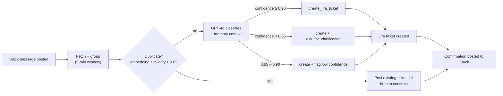

# JiraSlack — AI Triage Agent

> Reads Slack. Creates Jira tickets automatically — and flags it when it's not sure.

JiraSlack watches a Slack channel for bug reports, feature requests, and tasks, classifies each one with GPT-4o, and creates a structured Jira ticket automatically. When it's confident, it acts. When it isn't, it asks. It never fails silently, and it never files the same bug twice.

```bash
python run_triage.py
```

---

## Why this exists

Teams have conversations that are already happening, live, in a Slack channel. 
Someone still has to read every message, decide if it's ticket-worthy, classify it, and create it in Jira by hand. 
That manual step is slow, inconsistent, and easy to skip  and every message that never becomes a ticket is invisible to planning and prioritization.
 - It can be a critical issue raised mid-execution, buried in back-and-forth, where the person responsible loses track of it or simply forgets — and it never gets picked up until someone rediscovers it later.

What that looks like in practice:

- A customer-facing bug gets mentioned once in a deploy thread at 6 PM. By next morning's standup it's scrolled past, nobody filed it, and it ships broken for another day.
- Two engineers separately notice the same crash and each raise it in a different thread. Without anything tying them together, both assume "someone else has it" — and it falls through the middle.
- A "quick fix" request during an incident channel gets a emoji and a "will do" — then the incident ends, the channel goes quiet, and the follow-up work is never turned into a ticket anyone is accountable for.
- A team member flags a vague but real problem ("search feels broken today") while heads-down on something else. It's real signal, but too unclear to act on immediately, so it gets silently dropped instead of being captured and clarified later.

The value is minimizing that no-value-add manual task of filing — while still giving the team a baseline ticket they can add information to, not a black box that files things without them.

---

## How it works



**Concrete example:**

> **Pavani, 9:15 AM:** "login page is crashing when password is empty"
> **Pavani, 9:16 AM:** "it started after yesterday's deploy"

The agent groups both messages and creates:

```
SCRUM-3 — Bug, High Priority
"Fix login crash on empty password"

Steps to Reproduce: Navigate to login → leave password empty → submit
Expected: Validation error shown, no crash
Context: Regression introduced after yesterday's deployment
Labels: login, regression
```

Then posts back: *"Created SCRUM-3 → https://yoursite.atlassian.net/browse/SCRUM-3"*

---

## What's shipped

| Capability | Status |
|---|---|
| Read Slack, group into conversation blocks, classify, create tickets, ask for clarification | ✅ |
| Never fail silently — Jira/OpenAI/Slack outages are posted to the channel, not swallowed | ✅ |
| Structured run logs, run summaries, Streamlit dashboard | ✅ |
| Duplicate detection via embedding similarity gate | ✅ |
| Quality feedback loop — 👍/👎 Slack reactions → rolling quality metrics → alerting | ✅ |
| Episodic + semantic memory — the agent gets smarter across runs, not just within one | ✅ |
| Model-agnostic LLM provider — swap OpenAI ↔ Anthropic via one config value | ✅ |
| Scheduled / continuous execution, event-driven Slack trigger | ⬜ planned |

Full breakdown in [`PROJECT_ROADMAP.md`](PROJECT_ROADMAP.md).

---

## Tech stack

| Layer | Technology |
|---|---|
| Language | Python 3.11, fully async |
| LLM | GPT-4o via `openai` SDK, behind a provider-agnostic interface |
| Slack | Slack MCP server |
| Jira | Jira REST API v3 |
| Memory | SQLite / JSON — episodic decisions + extracted semantic patterns |
| Tests | pytest + pytest-asyncio — 277 tests, all I/O mocked at the process boundary |
| Observability | Structured run logs + Streamlit dashboard |

---

## My approach

I didn't start by opening an editor. Before any code existed, I worked through this in order:

1. **Wrote down what I actually wanted this to do** — the goal, the scope, and how it would create value — before deciding on any implementation. This became the customer-problem framing in `docs/plans/*-brainstorm.md`: who the actors are, what "done" looks like, and what's explicitly out of scope.
2. **Broke it into tasks.** The roadmap isn't one big build — it's phases (core pipeline → failure transparency → observability → duplicate detection → eval/feedback → memory → provider abstraction), each with its own milestone and its own definition of done.
3. **Wrote the golden dataset and evals before writing the feature.** `tests/eval/label_fixtures.json` and the classification playbook in `tests/eval/FIXTURES_GUIDE.md` define what "correct" means — Bug vs. Story vs. Task, High vs. Medium vs. Low — *before* any classification code was scored against it. Judge calibration (gold + mismatch runs) came before the judge was trusted for anything.
4. **Used a structured process instead of vibecoding.** Every feature went through the same gate: `/brainstorm` (what/why) → `/design` (how) → `/plan` (exact files, tests, order) → `/build` (red/green/refactor/commit) → `/audit` (tests pass + behavior verified) → `/kaizen` (cleanup, debt logged) → `/closeout` (docs + history written). Hard rule: no `/design` without an approved brainstorm, no `/build` without an approved plan, no `/closeout` without a passing audit. Slower per feature, close to zero rework.

---

## What I learned building this

- **Writing the eval before the feature forces you to define "correct" up front.** The tricky-case table in `FIXTURES_GUIDE.md` (a missing safety guard is a Bug, not a Story; a wrong doc is a Task, not a Bug) only exists because I had to write down the rule *before* I had code to rationalize around.
- **Mock only at real process boundaries.** I broke four tests by mocking a pure in-memory list-append (`add_episode`) — the mock made a threshold check silently pass because the state it depended on never actually mutated. Disk, network, and subprocess calls are mock targets. Plain Python state mutation is not.
- **Explicit state beats a side channel, even when the side channel looks simpler.** Passing memory into the agent as an explicit `MemoryContext` object (rather than a module-level dict another module writes into) cost one extra parameter and paid for itself immediately — every test could construct it directly instead of patching hidden global state.
- **The moment a function starts managing "before" and "after" a core step, split it out.** Eval logic (pre-run reaction collection, post-run judge scoring) started inside the main run loop. Pulling it into its own `eval_runner.py` turned a fragile order-of-operations test into a ten-line one.
- **A running "learnings" log compounds.** Every session ends with three questions answered in `docs/LEARNINGS.md`: what broke and why, what took longer than expected, what I'd tell myself at the start. Reading that file at the start of the *next* brainstorm caught at least two repeat mistakes before they happened again.

---

## Quickstart

```bash
git clone <repo>
cd JiraSlack
pip install -r requirements.txt
cp config/.env.example config/.env
```

Fill in `config/.env`:

```
OPENAI_API_KEY=sk-...
SLACK_BOT_TOKEN=xoxb-...
SLACK_CHANNEL_ID=C...
JIRA_URL=https://yoursite.atlassian.net
JIRA_EMAIL=your@email.com        # must match the Atlassian account that owns the token
JIRA_API_TOKEN=ATATT3x...
JIRA_PROJECT_KEY=SCRUM
```

> **Gotcha:** `JIRA_EMAIL` must exactly match the email of the Atlassian account that generated the API token — a mismatch returns 401 even with a valid token. See `docs/LEARNINGS.md`.

Invite the bot to the channel (`/invite @your-bot-name`), then:

```bash
python run_triage.py
```

Full config reference (thresholds, memory settings, eval settings) is in [`CLAUDE.md`](CLAUDE.md).

---

## Running tests

```bash
pytest tests/unit/ -v         # fast, all I/O mocked
pytest tests/integration/ -v  # real MCP connections, read-only
pytest -v                     # full suite
```

---

## Project structure

```
JiraSlack/
├── run_triage.py                 # Entry point
├── config/settings.py            # Typed settings, all config from .env
├── pipeline/                     # Slack fetch, context grouping, duplicate detection, eval, memory lifecycle
├── agents/
│   ├── triage/triage_agent.py    # GPT-4o tool-calling loop
│   ├── triage/tools/             # create_jira_ticket, post_slack_message, ask_for_clarification
│   └── llm/                      # Provider-agnostic LLM interface (OpenAI today, Anthropic-ready)
├── memory/                       # Episodic + semantic stores, embedding cache
├── tests/
│   ├── unit/                     # 266 tests, all I/O mocked
│   ├── integration/              # 11 tests, real MCP connections, read-only
│   └── eval/                     # Golden dataset + classification labeling guide
├── docs/
│   ├── plans/                    # Brainstorm → design → plan doc per feature
│   ├── LEARNINGS.md              # Gotchas and decisions, written after every session
│   └── BUGS.md                   # Active bugs and tech debt
├── .agent/workflows/              # The SDLC commands described above
├── PROJECT_ROADMAP.md            # Vision → goals → phases → capabilities
└── PROJECT_HISTORY.md            # Session-by-session build log
```

---

## Development process (the part that isn't the agent)

This repo was built using a portable 7-step SDLC — `/brainstorm → /design → /plan → /build → /audit → /kaizen → /closeout` — defined in `.agent/workflows/` and referenced from `CLAUDE.md`. It's project-agnostic: copying the `.agent/workflows/` folder and filling in the "Workflow Contracts" section of `CLAUDE.md` (test runner, key modules, mocking conventions) is enough to reuse it on a different codebase.
