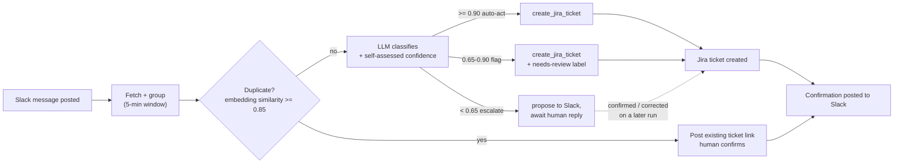

# JiraSlack — AI Triage Agent

> Reads Slack. Creates Jira tickets automatically and flags it when it's not sure.

JiraSlack watches a Slack channel for bug reports, feature requests, and tasks, classifies each one with an LLM (Claude by default), and creates a structured Jira ticket automatically. When it's confident, it acts. When it isn't, it flags the ticket or asks a human to confirm before filing. It never fails silently, and it never files the same bug twice.

```bash
python run_triage.py
```

---

## Why this exists

Teams have conversations that are already happening, live, in a Slack channel. 
Someone still has to read every message, decide if it's ticket-worthy, classify it, and create it in Jira by hand. 
That manual step is slow, inconsistent, and easy to skip  and every message that never becomes a ticket is invisible to planning and prioritization.
 - It can be a critical issue raised mid-execution, buried in back-and-forth, where the person responsible loses track of it or simply forgets — and it never gets picked up until someone rediscovers it later.

What that looks like in practice:

- A customer-facing bug gets mentioned once in a deploy thread at 6 PM. By next morning's standup it's scrolled past, nobody filed it, and it ships broken for another day.
- Two engineers separately notice the same crash and each raise it in a different thread. Without anything tying them together, both assume "someone else has it" — and it falls through the middle.
- A "quick fix" request during an incident channel gets a emoji and a "will do" — then the incident ends, the channel goes quiet, and the follow-up work is never turned into a ticket anyone is accountable for.
- A team member flags a vague but real problem ("search feels broken today") while heads-down on something else. It's real signal, but too unclear to act on immediately, so it gets silently dropped instead of being captured and clarified later.

The value is minimizing that no-value-add manual task of filing — while still giving the team a baseline ticket they can add information to, not a black box that files things without them.

---

## How it works



Confidence is code enforced, not left to the LLM's own judgment: `create_jira_ticket` always requires a `confidence` field, and a pure `route_confidence()` function decides the tier. Below the escalate threshold, no ticket is filed yet, the proposal is persisted and resolved on a later run once a human replies (affirmative → filed as proposed; a correction → one re-classification call, then filed). See [`docs/plans/2026-08-03-confidence-routing-design.md`](docs/plans/2026-08-03-confidence-routing-design.md) for the full design.

This covers the per-message routing logic. For the full system: memory load/persist, the eval and quality-feedback loop, and how everything connects across runs - see the [end-to-end flow diagram](docs/ARCHITECTURE.md#end-to-end-flow) in the architecture doc.

**Concrete example:**

> **Pavani, 9:15 AM:** "login page is crashing when password is empty"
> **Pavani, 9:16 AM:** "it started after yesterday's deploy"

The agent groups both messages and creates:

```
SCRUM-3 — Bug, High Priority
"Fix login crash on empty password"

Steps to Reproduce: Navigate to login → leave password empty → submit
Expected: Validation error shown, no crash
Context: Regression introduced after yesterday's deployment
Labels: login, regression
```

Then posts back: *"Created SCRUM-3 → https://yoursite.atlassian.net/browse/SCRUM-3"*

---

## What's shipped

| Capability | Status |
|---|---|
| Read Slack, group into conversation blocks, classify, create tickets, ask for clarification | ✅ |
| Never fail silently — Jira/OpenAI/Slack outages are posted to the channel, not swallowed | ✅ |
| Structured run logs, run summaries, Streamlit dashboard | ✅ |
| Duplicate detection via embedding similarity gate | ✅ |
| Quality feedback loop — 👍/👎 Slack reactions → rolling quality metrics → alerting | ✅ |
| Eval framework — golden dataset (labeled fixtures) + LLM-as-judge scoring on type/priority/title/description fit | ✅ |
| Code-enforced confidence routing — auto-act / flag / escalate-to-human-confirmation, with cross-run pending-confirmation resolution | ✅ |
| Episodic + semantic memory — the agent gets smarter across runs, not just within one | ✅ |
| Model-agnostic LLM provider — Claude by default; swap to OpenAI via `LLM_PROVIDER` | ✅ |
| Scheduled / continuous execution, event-driven Slack trigger | ⬜ planned |

Full breakdown in [`PROJECT_ROADMAP.md`](PROJECT_ROADMAP.md).

---

## Tech stack

| Layer | Technology |
|---|---|
| Language | Python 3.11, fully async |
| LLM | Claude (default) via Anthropic SDK, or GPT-4o via OpenAI — provider-agnostic interface |
| Slack | Slack MCP server |
| Jira | Jira REST API v3 |
| Memory | JSON files — episodic decisions, extracted semantic patterns, pending confirmations, embedding cache |
| Tests | pytest + pytest-asyncio — 341 tests (330 unit + 11 integration), all I/O mocked at the process boundary |
| Observability | Structured run logs + Streamlit dashboard |

---

## Engineering process

This was built with a golden dataset and evals written *before* the classification feature itself, and a structured brainstorm → design → plan → build → audit → kaizen → closeout workflow for every feature — not vibecoded. Full write-up of the approach and lessons learned is in [`docs/ENGINEERING_PROCESS.md`](docs/ENGINEERING_PROCESS.md).

---

## Quickstart

```bash
git clone https://github.com/pavani-aiml-space/jira-slack-triage-agent.git
cd jira-slack-triage-agent
pip install -r requirements.txt
cp config/.env.example config/.env
```

Fill in `config/.env`:

```
LLM_PROVIDER=anthropic
LLM_MODEL=claude-sonnet-4-5-20250929
ANTHROPIC_API_KEY=sk-ant-...
OPENAI_API_KEY=sk-...            # still required for embeddings (duplicate detection)
SLACK_BOT_TOKEN=xoxb-...
SLACK_CHANNEL_ID=C...
JIRA_URL=https://yoursite.atlassian.net
JIRA_EMAIL=your@email.com        # must match the Atlassian account that owns the token
JIRA_API_TOKEN=ATATT3x...
JIRA_PROJECT_KEY=SCRUM
```

To use OpenAI for triage instead of Claude:

```
LLM_PROVIDER=openai
LLM_MODEL=gpt-4o
```

> **Gotcha:** `JIRA_EMAIL` must exactly match the email of the Atlassian account that generated the API token — a mismatch returns 401 even with a valid token. See `docs/LEARNINGS.md`.

> **Gotcha:** Duplicate detection embeddings always use OpenAI (`OPENAI_API_KEY`), even when triage runs on Claude.

Invite the bot to the channel (`/invite @your-bot-name`), then:

```bash
python run_triage.py
```

Full config reference (thresholds, memory settings, eval settings) is in [`CLAUDE.md`](CLAUDE.md).

---

## Running tests

```bash
pytest tests/unit/ -v         # fast, all I/O mocked
pytest tests/integration/ -v  # real MCP connections, read-only
pytest -v                     # full suite
```

---

## Project structure

```
JiraSlack/
├── run_triage.py                 # Entry point
├── config/settings.py            # Typed settings, all config from .env
├── pipeline/                     # Slack fetch, context grouping, duplicate detection, eval,
│                                  # memory lifecycle, confidence routing, pending-confirmation resolution
├── agents/
│   ├── triage/triage_agent.py    # LLM tool-calling loop (Claude by default)
│   ├── triage/tools/             # create_jira_ticket, post_slack_message, ask_for_clarification,
│   │                              # search_memory, confirmation_tools (low-confidence escalation)
│   └── llm/                      # Provider-agnostic LLM (Anthropic default, OpenAI optional)
├── mcp_servers/                  # MCP client + per-server configs (Slack MCP, mcp-atlassian) — swappable
├── memory/                       # Episodic + semantic stores, embedding cache, pending confirmations
├── tests/
│   ├── unit/                     # 330 tests, all I/O mocked
│   ├── integration/              # 11 tests, real MCP connections, read-only
│   └── eval/                     # Golden dataset + classification labeling guide
├── docs/
│   ├── plans/                    # Brainstorm → design → plan doc per feature
│   ├── ARCHITECTURE.md           # Full system walkthrough + end-to-end flow diagram
│   ├── LEARNINGS.md              # Gotchas and decisions, written after every session
│   └── BUGS.md                   # Active bugs and tech debt
├── .agent/workflows/              # The SDLC commands described above
├── PROJECT_ROADMAP.md            # Vision → goals → phases → capabilities
└── PROJECT_HISTORY.md            # Session-by-session build log
```

---

## Development process

See [`docs/ENGINEERING_PROCESS.md`](docs/ENGINEERING_PROCESS.md) for the full write-up of the 7-step SDLC (`/brainstorm → /design → /plan → /build → /audit → /kaizen → /closeout`) used to build this, the approach taken, and lessons learned along the way.
