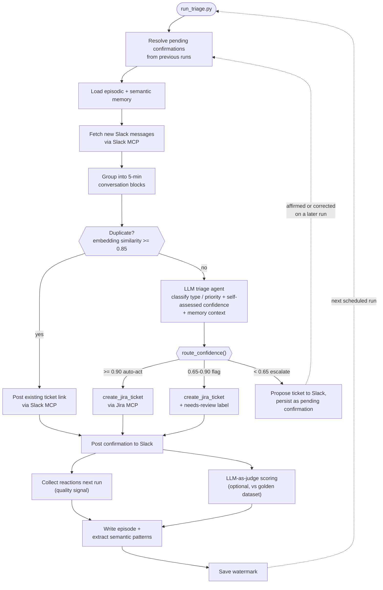

# JiraSlack — System Architecture

> Plain-English walkthrough of the entire system: what every component does, how they connect, and why each design decision was made.
>
> Updated: 2026-04-30 (post Phase 7)

---

## The Problem in One Sentence

Engineers report bugs and requests in Slack, but someone has to read them, decide what to do, and manually create a Jira ticket — which is slow, inconsistent, and easy to miss.

JiraSlack replaces that human step with an AI agent that runs on demand, reads the Slack channel, decides what to do for each message, creates the Jira ticket, and posts a confirmation — all without human intervention when the message is clear enough.

---

## End-to-End Flow



**Confidence routing (Phase 10):** the LLM always self-assesses a `confidence` score when proposing a ticket; a pure `route_confidence()` function — not the LLM's own judgment — decides the tier. Escalated proposals don't file a ticket on the spot: they're posted to Slack and persisted, then resolved on a later run's `Resolve` step — an affirmative reply files as proposed, a correction triggers one re-classification call, and no reply past `PENDING_CONFIRMATION_MAX_AGE_HOURS` auto-files as a safety net. See [`docs/plans/2026-08-03-confidence-routing-design.md`](plans/2026-08-03-confidence-routing-design.md).

## The Pipeline at 30,000 Feet

```
python run_triage.py
        │
        ▼
┌─────────────────────────────────────────────────────────────────────┐
│ 1. Load memory (episodic + semantic)                                │
│ 2. Collect Slack reactions from previous run (quality signal)       │
│ 3. Read Slack channel → group into conversation blocks              │
│ 4. For each block: duplicate gate → GPT-4o tool loop               │
│ 5. Register new confirmation posts for next run's reaction polling  │
│ 6. Save new episodes, extract semantic patterns                     │
└─────────────────────────────────────────────────────────────────────┘
```

Every step is explained in detail below.

---

## Entry Point: `run_triage.py`

This file is the conductor. It calls out to every other component in the correct order but contains no business logic itself.

**Why this matters:** Any change to the pipeline order (e.g. adding a new pre/post hook) happens here and only here — no other file needs to know about the run lifecycle.

The five steps in `main()`:

| Step | What it calls | Why |
|------|--------------|-----|
| `memory_runner.pre_run()` | Loads episode and semantic stores from disk; builds a `MemoryContext` object containing the semantic injection string and the loaded `EpisodeStore` | Memory must be ready before the agent processes any block |
| `run_eval_step(None)` | Reads Slack reactions on previous confirmation posts; updates quality metrics | Collect feedback before the new run so the metrics reflect the current state |
| `triage_run(memory_context=...)` | The main Slack → Jira pipeline | Where tickets actually get created |
| `run_eval_step(run_log)` | Registers the confirmation post timestamps from this run for next run's reaction polling | The timestamps are only known after the run completes |
| `memory_runner.post_run(run_log)` | Writes new episodes to disk; triggers semantic pattern extraction if enough new episodes have accumulated | Memory is written last so any crash mid-run doesn't corrupt the stores |

---

## Step 1: Memory Pre-Run (`pipeline/memory_runner.py`)

### What it does

`pre_run()` returns a `MemoryContext` — a small dataclass with two fields:
- `semantic_injection: str` — a text block summarising what the agent has learned across past runs (e.g. "Login-related bugs are always High priority; auth stories are typically Medium"). This gets prepended to the GPT-4o system prompt.
- `episode_store: EpisodeStore` — the full in-memory episodic store, which `triage_agent.run()` uses to find relevant past decisions for each block.

If either JSON file is missing or corrupt, `pre_run()` returns a `MemoryContext` with an empty string and an empty store. The agent runs normally — it just starts fresh.

### Why memory is loaded here, not inside the agent

The agent (`triage_agent.run()`) is stateless and reusable. It receives memory as an explicit argument, which makes it unit-testable without any disk I/O and makes it possible to run multiple agents with different memory contexts in the future.

---

## Step 2: Quality Eval Pre-Run (`pipeline/eval_runner.py`)

### What it does

`run_eval_step(None)` is the "collect reactions" step. It:
1. Reads the `quality_store.json` file, which contains a list of pending `(message_ts, ticket_key, run_id)` tuples from previous runs.
2. For each pending entry, calls the Slack MCP to fetch 👍/👎 reactions on that message.
3. Updates the rolling quality metrics (thumbs-up rate per run, rolling rate across all runs).
4. If the rolling thumbs-up rate drops below `QUALITY_ALERT_THRESHOLD` and at least `MIN_REACTIONS_FOR_QUALITY` reactions have been collected, posts a quality alert to Slack.
5. Saves the updated store back to disk.

### Why the eval step runs before triage, not after

Reactions arrive asynchronously — a team member might react to a confirmation post hours after the run. By polling at the *start* of the next run, we get the most up-to-date reaction counts before computing metrics, without requiring a webhook or a persistent background process.

---

## Step 3: Triage Run (`agents/triage/triage_agent.py`)

This is the core of the system. `triage_run()` in `run_triage.py` calls `triage_agent.run()`, which:

### 3a. Fetch messages and open tickets in parallel

`asyncio.gather()` fires two concurrent tasks:
- Fetch the last `MAX_MESSAGES_TO_FETCH` Slack messages from the channel via Slack MCP.
- Fetch all open Jira tickets (paginated) via Jira MCP.

**Why in parallel:** Fetching Jira tickets is the slowest operation (can take 1–2 seconds for large projects). Running it concurrently with Slack message fetching cuts the overall latency roughly in half.

### 3b. Build / refresh the embedding cache

The duplicate detector needs an embedding for every open Jira ticket. At run start, `build_embedding_cache()` in `pipeline/duplicate_detector.py`:
- Adds any tickets not yet in `memory/ticket_embeddings.json`.
- Re-embeds tickets whose summary has changed.
- Removes tickets that are no longer open.

Embeddings are generated by the OpenAI `text-embedding-3-small` model via `asyncio.to_thread()` (because the OpenAI SDK is synchronous).

### 3c. Group Slack messages into conversation blocks

`context_builder.py` groups messages into time-window blocks. Any messages within `CONTEXT_WINDOW_MINUTES` of each other are treated as part of the same conversation. Each block is sent to the LLM as a single unit — the LLM sees the full conversational context, not isolated messages.

### 3d. For each block: duplicate gate

Before calling the LLM, `find_duplicate()` embeds the block text and computes cosine similarity against every ticket in the cache. If the similarity exceeds `DUPLICATE_SIMILARITY_THRESHOLD` (default 0.85), the block is flagged as a likely duplicate and the LLM is instructed to post the existing ticket link rather than create a new one.

**Why a pre-gate instead of letting the LLM decide:** The LLM cannot see the Jira ticket database. Without the pre-gate, it would create duplicate tickets every time the same issue is reported twice. The embedding gate is cheap (one API call) and completely reliable for near-identical text.

### 3e. For each block: inject working memory

If a `MemoryContext` was passed in:
1. **Semantic injection** — the `semantic_injection` string is appended to the GPT-4o system prompt for this run. It describes patterns the agent has observed across past runs (e.g. which ticket types tend to be high priority, which keywords correlate with bugs vs. stories).
2. **Episode retrieval** — the block's embedding (already computed by the duplicate gate) is reused to find the top-K most similar past episodes in `EpisodeStore`. These are formatted as a short "precedent" paragraph and injected into the user message for this block.

**Why reuse the block embedding:** The duplicate gate already embedded the block. Reusing that vector for episode retrieval means zero extra API calls per block.

**Why semantic → system prompt, episodes → user message:** Semantic patterns are run-level context (the same for every block). Injecting them once into the system prompt is efficient. Episodes are block-level context (the top-K most relevant past decisions for *this specific block*) — they belong in the user message.

### 3f. For each block: GPT-4o tool-calling loop

`_run_llm_loop()` sends the block text (plus any memory context) to GPT-4o with three tools available:

| Tool | When GPT-4o calls it | What it does |
|------|---------------------|--------------|
| `create_jira_ticket` | Message is clear enough to act on (confidence ≥ `CONFIDENCE_AUTO_ACT`) | Calls Jira MCP to create a ticket; posts confirmation to Slack with ticket link |
| `post_slack_message` | Needs to notify the team about something (duplicate, quality flag, etc.) | Posts a message to the channel via Slack MCP |
| `ask_for_clarification` | Message is too vague to act on (confidence < `CONFIDENCE_ASK_HUMAN`) | Posts a structured INVEST prompt to Slack asking the reporter to provide more detail |

The loop continues until GPT-4o returns a response with no tool calls, or `MAX_AGENT_ITERATIONS` is reached.

**Why tool-calling instead of a classifier:** A pure classifier can only output a label. Tool-calling lets GPT-4o both classify and act in the same step. It also allows the model to call multiple tools in one pass (e.g. create a ticket *and* post a quality flag) without an extra round-trip.

### 3g. Capture confirmation timestamps

After each `ticket_created` event, `drain_confirmation_ts()` retrieves the Slack `message_ts` of the confirmation post from `slack_tools._confirmation_ts_buffer`. These timestamps are stored in the `RunLog` for later use by `run_eval_step(run_log)`.

---

## Step 4: Quality Eval Post-Run (`pipeline/eval_runner.py`)

`run_eval_step(run_log)` registers the confirmation post timestamps from this run into `quality_store.json` as "pending" entries. They will be polled for reactions at the start of the *next* run.

---

## Step 5: Memory Post-Run (`pipeline/memory_runner.py`)

`post_run(run_log)` does two things:

### Write new episodes

For every `ticket_created` entry in the `RunLog`, a new `Episode` is appended to the `EpisodeStore`:
- `block_snippet` — the first 200 characters of the Slack block text (for display)
- `ticket_summary` — the Jira ticket title that was created
- `embedding` — the float vector of the ticket summary (used for retrieval)

The store is pruned to `MAX_EPISODES` (oldest removed first) and saved to `memory/episode_store.json`.

### Extract semantic patterns (when threshold is met)

If the number of new episodes since the last extraction is ≥ `SEMANTIC_EXTRACTION_THRESHOLD`:
1. `extract_count_patterns()` tallies `(ticket_type, priority, keyword)` triples across all episodes — this is fast, pure, and requires no API call.
2. If there are ≥ `SEMANTIC_LLM_MIN_PATTERNS` patterns, `summarise_with_llm()` sends the patterns to GPT-4o and asks it to write a concise natural-language summary (max `MAX_SEMANTIC_PATTERN_CHARS` chars). This summary becomes the `semantic_injection` string on the next run.
3. If the LLM call fails, the raw count-based summary is used instead (Rule 10 — never block on LLM extraction failure).

---

## Data Stores

| File | What it holds | Who reads it | Who writes it |
|------|--------------|-------------|--------------|
| `memory/ticket_embeddings.json` | Float embeddings for every open Jira ticket | `duplicate_detector.find_duplicate()` | `duplicate_detector.build_embedding_cache()` |
| `memory/quality_store.json` | Pending reaction entries + rolling quality metrics | `eval_runner.run_eval_step()` | `eval_runner.run_eval_step()` |
| `memory/episode_store.json` | Past `ticket_created` decisions with embeddings | `memory_runner.pre_run()` → `triage_agent.run()` | `memory_runner.post_run()` |
| `memory/semantic_store.json` | Extracted patterns + LLM summary | `memory_runner.pre_run()` | `memory_runner.post_run()` |
| `logs/run_<ISO>.json` | Full structured log of every run | Dashboard, manual inspection | `run_logger.write_run_log()` |

All JSON stores are safe to delete — the agent recreates them from scratch on the next run. None are locked or transactional; concurrent writes from multiple agent instances would corrupt them, but the agent is designed to be run serially.

---

## External Services and How They're Called

### Slack (via Slack MCP)

All Slack calls go through `slack_mcp_session()`, a context manager in `mcp_servers/slack_mcp.py`. It starts the `@modelcontextprotocol/server-slack` Node.js process as a stdio subprocess, sends JSON-RPC calls over stdin, and reads responses from stdout. When the context manager exits, the subprocess is terminated.

**Why MCP instead of the Slack SDK directly:** The MCP server handles OAuth token management, rate limiting, and API versioning. The agent only needs to call named tools (`slack_post_message`, `slack_get_channel_history`, `slack_get_reactions`) without knowing the Slack API shape.

### Jira (via Jira MCP)

All Jira calls go through `jira_mcp_session()`, which works the same way using the `mcp-atlassian` stdio server. Tools used: `jira_create_issue`, `jira_search` (JQL).

**Why not the Jira REST API directly:** Jira MCP abstracts auth (Basic Auth with email + API token) and returns flat response objects that are easier to parse than the nested REST response. It also keeps the auth credentials out of the Python code.

### OpenAI (direct SDK)

Two OpenAI integrations:
1. **Chat completions** (`gpt-4o`) — the tool-calling loop in `triage_agent._run_llm_loop()`. Uses the synchronous `openai.OpenAI` client wrapped in `asyncio.to_thread()`.
2. **Embeddings** (`text-embedding-3-small`) — for duplicate detection and episode retrieval. Same sync-wrapped-in-thread pattern.

**Why `asyncio.to_thread()`:** The OpenAI Python SDK is synchronous. Calling it directly in an `async def` would block the event loop, preventing concurrent Slack/Jira calls. `asyncio.to_thread()` offloads the blocking call to a thread pool without changing the calling code.

---

## Configuration (`config/settings.py`)

All configuration comes from `config/.env` via `python-dotenv`. The `Settings` class reads every variable once at import time and exposes typed attributes. No code outside `settings.py` calls `os.getenv()`.

**Why a typed settings class:** Every config variable has a documented default, type annotation, and a single place to change it. Tests can patch `settings.SETTING_NAME` directly without mocking `os.environ`.

---

## Error Handling — The Priority Rules

The system has 11 priority rules (see `CLAUDE.md`) that govern every failure mode. The most important ones for understanding the system's behaviour:

- **Rule 1** — If Jira is unavailable, post to Slack and continue. Never fail silently.
- **Rule 2** — If a message is vague, create a ticket with what's available and post a clarification prompt. Never block.
- **Rule 4** — If a duplicate is detected, post the existing ticket link and ask the human to confirm. Never silently skip.
- **Rule 5** — If Slack MCP fails mid-run, continue processing all remaining blocks and report errors at the end.
- **Rule 6** — If OpenAI is unavailable, post the error to Slack and tell the team to triage manually.
- **Rule 10** — If the LLM semantic extraction call fails, fall back to count-based patterns. Never block on this.
- **Rule 11** — If episode retrieval returns no matches, continue without episode injection. This is the cold-start state.

---

## Testing Architecture

```
tests/
├── unit/          — 206 tests, all I/O mocked; run in ~1 second
└── integration/   — 11 tests; hit real Slack + Jira MCP; require live credentials
```

### Unit test philosophy

Every external boundary is mocked:
- `jira_mcp_session()` and `slack_mcp_session()` are patched to return `AsyncMock` objects.
- `openai.OpenAI` client is patched at `triage_agent._client`.
- Disk I/O (`load_episode_store`, `save_episode_store`, etc.) is patched — tests never touch the filesystem.
- `embed_texts` is patched to return deterministic vectors.

**The one exception:** `add_episode` (in `episode_store.py`) is a pure in-memory list append with no I/O. It is never mocked in tests that observe downstream threshold behaviour — patching it as a no-op would silently break those assertions.

### Integration tests

Integration tests in `tests/integration/` use real credentials from `config/.env` and verify that the MCP subprocesses start, authenticate, and respond correctly. They are read-only — they fetch data but never create tickets or post messages.

---

## How to Add a New Feature

Following the SDLC in `CLAUDE.md`:

1. **`/brainstorm`** — Define the customer problem, success metrics, and scope. No implementation details.
2. **`/design`** — Design the solution: which files change, what data flows where. No code.
3. **`/diagram`** — Produce the code-level diagram (ASCII + sequence + data flow).
4. **`/plan`** — Break the design into TDD chunks: RED test first, GREEN impl, REFACTOR, COMMIT.
5. **`/build`** — Execute the plan chunk by chunk.
6. **`/audit`** — Verify unit tests, integration tests, and E2E against real services.
7. **`/kaizen`** — Clean up: dead code, stale comments, type drift, debt logging.
8. **`/closeout`** — Update `LEARNINGS.md`, `PROJECT_HISTORY.md`, `PROJECT_ROADMAP.md`, `CLAUDE.md`, commit.

---

## What's Next

The next phase is **Phase 6 — Reliability**: state tracking (record last-processed Slack message timestamp) and scheduled execution (run on a configurable interval). See `PROJECT_ROADMAP.md` for the full user stories.
