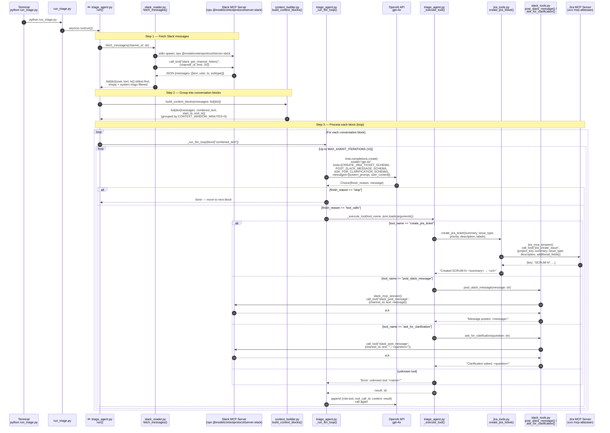
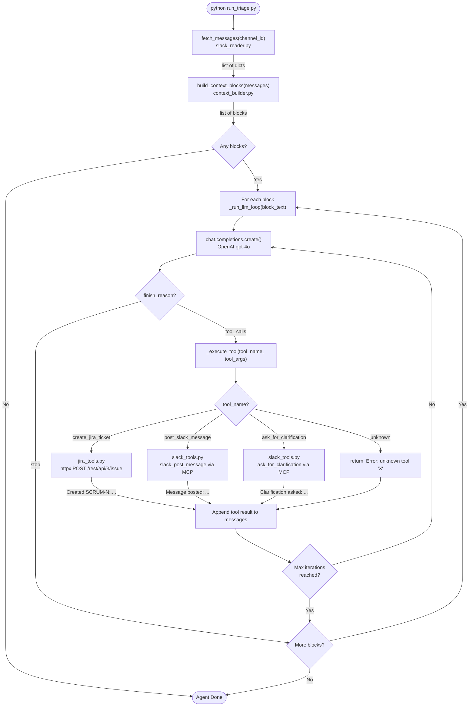

# Code Diagram: Core Pipeline

> Generated from: [Technical Design](../plans/2026-04-25-core-pipeline-design.md)
> Last updated: 2026-04-27
> Status: draft

---

## ASCII Overview

```
┌─────────────────────┐
│   run_triage.py     │
│   (entry point)     │
└──────────┬──────────┘
           │ asyncio.run(run())
           ▼
┌──────────────────────────────────────────────────────────────────┐
│                      triage_agent.py                             │
│                                                                  │
│  run()                                                           │
│   │                                                              │
│   ├─ fetch_messages(channel_id) ──────────▶ slack_reader.py      │
│   │                                             │                │
│   │                              slack_mcp_session()             │
│   │                                             │                │
│   │                                             ▼                │
│   │                                   ┌──────────────────┐       │
│   │                                   │  Slack MCP Server│       │
│   │                                   │  (npx server-    │       │
│   │                                   │   slack) [EXTL]  │       │
│   │                                   └──────────────────┘       │
│   │                                                              │
│   ├─ build_context_blocks(messages) ──▶ context_builder.py       │
│   │                                                              │
│   └─ _run_llm_loop(block_text)  [loop per block]                 │
│         │                                                        │
│         ├─ chat.completions.create() ─▶ ┌──────────────┐        │
│         │                               │ OpenAI gpt-4o│        │
│         │         tool_calls ◀──────────│    [EXTL]    │        │
│         │                               └──────────────┘        │
│         │                                                        │
│         └─ _execute_tool(tool_name, tool_args)                   │
│               │                                                  │
│               ├─[create_jira_ticket]──▶ jira_tools.py            │
│               │                             │                    │
│               │                   jira_mcp_session()             │
│               │                             │                    │
│               │                             ▼                    │
│               │                   ┌──────────────────┐          │
│               │                   │  Jira MCP Server │          │
│               │                   │  (uvx mcp-       │          │
│               │                   │  atlassian)[EXTL]│          │
│               │                   └──────────────────┘          │
│               │                                                  │
│               └─[post_slack_message / ask_for_clarification]     │
│                              ──▶ slack_tools.py                  │
│                                       │                          │
│                              slack_mcp_session()                 │
│                                       ▼                          │
│                              [Slack MCP Server] (reused)         │
└──────────────────────────────────────────────────────────────────┘
```

---

## Sequence Diagram



---

## Flowchart — Decision Logic



---

## Flow Plain-English

- **Entry** (`run_triage.py → asyncio.run(run())`)
  - **Purpose:** Starts the agent from the command line and bridges the sync shell into the async pipeline
  - **Input:** None — triggered by `python run_triage.py`
  - **Output:** Kicks off `triage_agent.run()`

- **Fetch Slack messages** (`slack_reader.py → fetch_messages()`)
  - **Purpose:** Connects to Slack via a local MCP subprocess and retrieves the most recent channel messages
  - **Input:** `channel_id: str`, `limit: int` (default 20)
  - **Output:** `list[dict{user, text, ts}]` — oldest-first, empty messages and system events removed

- **Start Slack MCP session** (`slack_reader.py → slack_mcp_session()`)
  - **Purpose:** Spawns the Slack MCP npm package as a subprocess and opens a live session for making Slack API calls
  - **Input:** `SLACK_BOT_TOKEN`, `SLACK_TEAM_ID` from settings
  - **Output:** A live `ClientSession` yielded as an async context manager

- **Group into conversation blocks** (`context_builder.py → build_context_blocks()`)
  - **Purpose:** Groups messages that are close together in time so the agent sees a full conversation, not isolated lines
  - **Input:** `list[dict{user, text, ts}]` — raw messages oldest-first
  - **Output:** `list[dict{messages, combined_text, start_ts, end_ts}]` — one block per time window

- **Run LLM loop** (`triage_agent.py → _run_llm_loop()`)
  - **Purpose:** Sends one conversation block to GPT-4o and loops, feeding tool results back, until GPT-4o signals it is done
  - **Input:** `block_text: str` — all messages in the block joined into one string
  - **Output:** None — side effects only (Jira tickets created, Slack messages posted)

- **Execute tool** (`triage_agent.py → _execute_tool()`)
  - **Purpose:** Looks up the tool GPT-4o requested by name and calls the matching Python function
  - **Input:** `tool_name: str`, `tool_args: dict` (parsed from GPT-4o's JSON arguments)
  - **Output:** `str` — result message appended back into the GPT-4o conversation

- **Create Jira ticket** (`jira_tools.py → create_jira_ticket()`)
  - **Purpose:** Creates a structured Jira ticket via the Jira MCP server using the summary, type, priority, and description provided by GPT-4o
  - **Input:** `summary, issue_type, priority, description, labels`
  - **Output:** `str` — e.g. `"Created SCRUM-3: Fix login crash → https://..."`

- **Start Jira MCP session** (`jira_tools.py → jira_mcp_session()`)
  - **Purpose:** Spawns `mcp-atlassian` via `uvx` as a subprocess and opens a live session for making Jira API calls — same pattern as `slack_mcp_session()`
  - **Input:** `--jira-url`, `--jira-username`, `--jira-token` passed as CLI args to the subprocess
  - **Output:** A live `ClientSession` yielded as an async context manager

- **Post Slack message** (`slack_tools.py → post_slack_message()`)
  - **Purpose:** Posts a confirmation or status message into the Slack channel so the team knows what the agent did
  - **Input:** `message: str`
  - **Output:** `str` — `"Message posted: <message>"`

- **Ask for clarification** (`slack_tools.py → ask_for_clarification()`)
  - **Purpose:** Posts a structured question in Slack when a message is too vague for the agent to act on confidently
  - **Input:** `question: str`
  - **Output:** `str` — `"Clarification asked: <question>"`

---

## Data Flow Summary

| Stage | Source | Shape | Destination |
|---|---|---|---|
| **In** | Slack channel | `[{user: str, text: str, ts: str}]` — 20 messages max, oldest first | `fetch_messages()` → `triage_agent.run()` |
| **Grouped** | `context_builder` | `[{messages: list, combined_text: str, start_ts: str, end_ts: str}]` — N blocks | `_run_llm_loop()` per block |
| **LLM input** | `_run_llm_loop` | `str` — `block["combined_text"]` sent as user message | OpenAI `/v1/chat/completions` |
| **LLM output** | OpenAI | `{finish_reason, message, tool_calls: [{function.name, function.arguments}]}` | `_execute_tool()` |
| **Tool args** | `_execute_tool` | `json.loads(function.arguments)` → `dict` | Tool executor function |
| **Jira out** | `jira_tools.py` | `call_tool("jira_create_issue", {project_key, summary, issue_type, description, additional_fields})` | Jira MCP Server (`uvx mcp-atlassian`) |
| **Jira response** | Jira MCP Server | `{key: "SCRUM-N"}` parsed from MCP content block | Returned as `str` to LLM message history |
| **Slack out** | `slack_tools.py` | `{channel_id, text: str}` | Slack MCP → `slack_post_message` |
| **Nothing stored** | — | No file, DB, or state written in Phase 1 | State tracking is Phase 3 |
