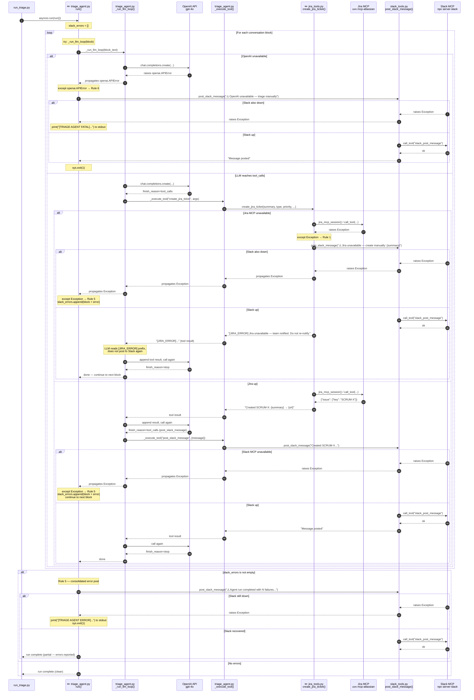
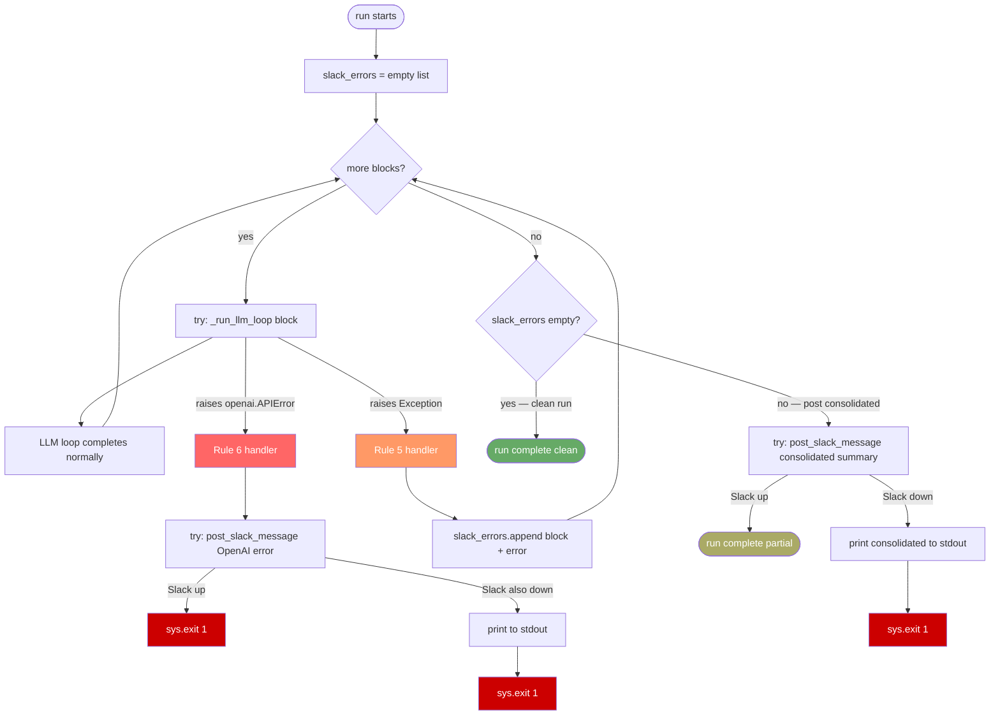

# Code Diagram: Phase 2 — Failure Transparency

> Generated from: [Technical Design](../plans/2026-04-29-phase2-failure-transparency-design.md)
> Last updated: 2026-04-29
> Status: draft

---

## ASCII Overview

Only two existing files are modified. No new files.

```
python run_triage.py
        │
        ▼
┌────────────────────────────────────────────────────┐
│  triage_agent.py  run()                      [MOD] │
│                                                    │
│  slack_errors: list[str] = []                      │
│                                                    │
│  for each block:                                   │
│    try:                                            │
│      await _run_llm_loop(block)  ──────────────┐  │
│    except openai.APIError:  ◀── Rule 6 handler  │  │
│      post_slack_message(OpenAI error)           │  │
│      sys.exit(1)                                │  │
│    except Exception:  ◀──────── Rule 5 handler  │  │
│      slack_errors.append(...)                   │  │
│      continue                                   │  │
│                                                 │  │
│  if slack_errors:                               │  │
│    post_slack_message(consolidated)             │  │
│    → if fails: print to stdout + exit(1)        │  │
└─────────────────────────────────────────────────┼──┘
                                                  │
                         ┌────────────────────────┘
                         ▼
         ┌────────────────────────────┐
         │  triage_agent.py           │
         │  _run_llm_loop(block_text) │
         │                            │
         │  _client.chat.completions  │
         │    .create(...)  ──────────┼──▶  OpenAI API
         │                            │     (raises APIError
         │  _execute_tool(name, args) │      → propagates up)
         └────────────┬───────────────┘
                      │
          ┌───────────┴──────────────┐
          │                          │
          ▼                          ▼
┌──────────────────────┐   ┌───────────────────────┐
│  jira_tools.py [MOD] │   │  slack_tools.py        │
│  create_jira_ticket()│   │  post_slack_message()  │
│                      │   │  ask_for_clarification │
│  try:                │   │                        │
│    jira_mcp_session()│   │  slack_mcp_session()   │
│    → uvx mcp-atlassian    │  → npx server-slack    │
│  except Exception:   │   │  (raises → propagates  │
│    post_slack_msg()  │   │   to run() per-block   │
│    return [JIRA_ERROR│   │   except Exception)    │
└──────────────────────┘   └───────────────────────┘
```

---

## Sequence Diagram



---

## Flowchart — Decision Logic in `run()`



---

## Data Flow Summary

| Stage | Source | Shape | Destination |
|---|---|---|---|
| Jira MCP exception | `uvx mcp-atlassian` subprocess | `Exception` with error message | Caught in `create_jira_ticket()` |
| Jira error alert | `create_jira_ticket()` | `str` — "⚠️ Jira unavailable — please create manually: {summary}" | `post_slack_message()` → Slack channel |
| Jira error return | `create_jira_ticket()` | `str` — "[JIRA_ERROR] Jira unavailable — team notified..." | `_execute_tool()` → LLM as tool result |
| OpenAI exception | `openai.APIError` subclass | Exception with `.message` field | Caught in `run()` per-block handler |
| OpenAI error alert | `run()` | `str` — "⚠️ OpenAI unavailable — triage manually: {error}" | `post_slack_message()` → Slack channel |
| Slack MCP exception | `npx server-slack` subprocess | `Exception` with error message | Propagates to `run()` per-block handler |
| Slack error accumulation | `run()` | `str` — "Block '{snippet}...': {error}" | `slack_errors` list (in-memory, per run) |
| Consolidated error post | `run()` | `str` — multi-line summary with N failed blocks | `post_slack_message()` → Slack channel |
| Last-resort stdout | `run()` | `str` — "[TRIAGE AGENT ERROR]..." | Terminal stdout |

**Nothing new is stored or mutated on disk in Phase 2.** All error state is in-memory within a single `run()` call.

---

## Flow Plain-English

- **Jira failure handler** (`jira_tools.py → create_jira_ticket()`)
  - **Purpose:** When the Jira MCP subprocess fails, immediately notify the team in Slack and return a special error string so the LLM knows not to send a second notification
  - **Input:** Any `Exception` raised by `jira_mcp_session()` or `session.call_tool()`; original ticket args (summary, type, priority)
  - **Output:** Slack alert posted; `str` starting with `[JIRA_ERROR]` returned to the LLM as the tool result

- **OpenAI failure handler** (`triage_agent.py → run()`)
  - **Purpose:** When OpenAI is unreachable, stop the entire run immediately and tell the team to triage manually — the agent is useless without the LLM
  - **Input:** `openai.APIError` propagated from `_run_llm_loop()`
  - **Output:** Slack alert posted (or stdout if Slack is also down); process exits with code 1

- **Slack MCP per-block accumulator** (`triage_agent.py → run()`)
  - **Purpose:** When a Slack post fails mid-run, record the failure and continue processing remaining blocks so no messages are silently skipped
  - **Input:** `Exception` propagated from `post_slack_message()` or `ask_for_clarification()` through the LLM loop
  - **Output:** Error appended to `slack_errors` list; block processing continues

- **Consolidated error report** (`triage_agent.py → run()`)
  - **Purpose:** At the end of a run with Slack failures, post one summary message listing every block that could not be notified — the team knows exactly which messages need manual follow-up
  - **Input:** `slack_errors` list (non-empty); each entry has block text snippet + error detail
  - **Output:** Single Slack message with all failures listed; or stdout + exit 1 if Slack is still down

- **Stdout last-resort fallback** (`triage_agent.py → run()`)
  - **Purpose:** When Slack itself is unavailable and no notification can be posted, write the full error to terminal output so it is captured by any CI/CD or process manager running the agent
  - **Input:** Any `Exception` raised by the final `post_slack_message()` calls (OpenAI handler or consolidated post)
  - **Output:** `[TRIAGE AGENT FATAL]` or `[TRIAGE AGENT ERROR]` prefixed lines written to stdout; process exits with code 1
