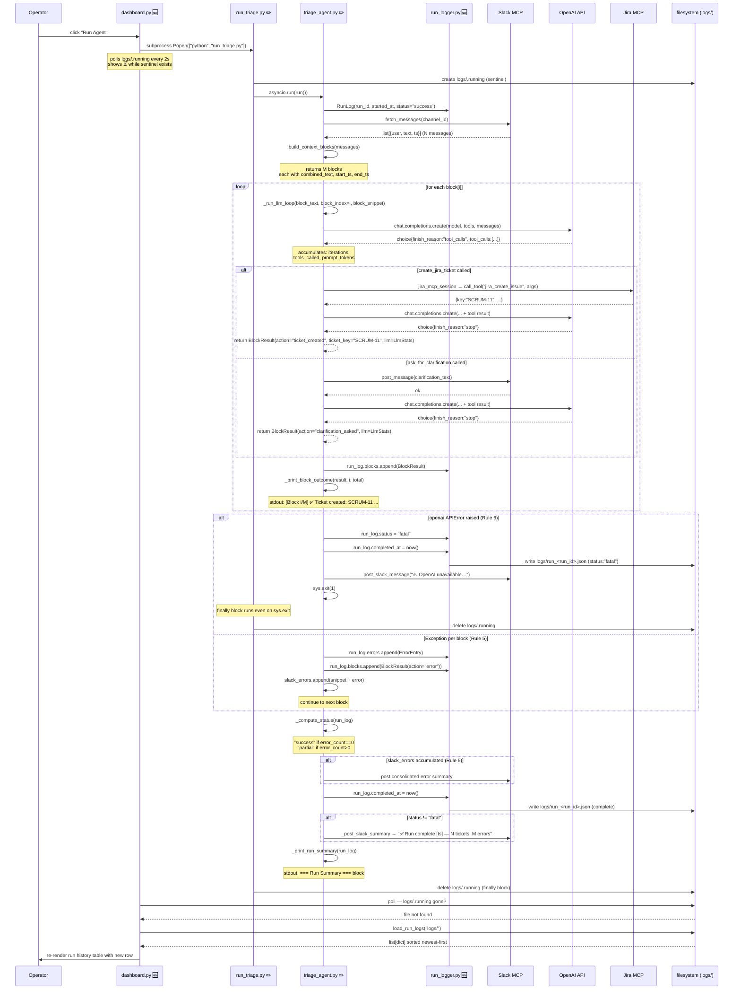
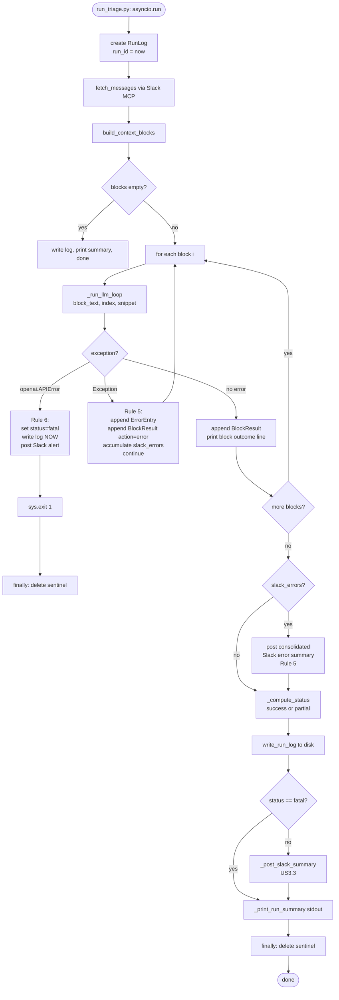

# Code Diagram: Phase 3 — Observability

> Generated from: [Technical Design](../plans/2026-04-29-phase3-observability-design.md)
> Last updated: 2026-04-29
> Status: draft

---

## ASCII Overview

```
  TRIGGER                   ENTRY POINT              AGENT CORE
  ─────────────────         ─────────────────────    ──────────────────────────────────────────
  ┌─────────────┐           ┌──────────────────┐     ┌──────────────────────────────────────┐
  │ dashboard.py│──Popen──▶│  run_triage.py   │────▶│        triage_agent.py               │
  │  [NEW]      │           │  [MOD]           │     │  [MOD]                               │
  │             │           │                  │     │  run()                               │
  │  load_run_  │           │  create sentinel │     │    ├─ fetch_messages()               │
  │  logs()     │◀──JSON────│  asyncio.run()   │     │    ├─ build_context_blocks()         │
  │             │           │  delete sentinel │     │    ├─ _run_llm_loop() → BlockResult  │
  └─────────────┘           └──────────────────┘     │    ├─ _print_block_outcome()         │
       │                                              │    ├─ write_run_log()                │
       │polls                                         │    ├─ _post_slack_summary()          │
       ▼                                              │    └─ _print_run_summary()           │
  ┌─────────────┐                                     └──────────────┬───────────────────────┘
  │ logs/       │                                                    │
  │ .running    │◀─────────────────────────── create/delete ────────┘
  │ run_*.json  │◀─────────────────────────── write_run_log() ──────┐
  └─────────────┘                                                    │
                                                                     │
  SERVICES                  EXTERNAL                                 │
  ─────────────────         ─────────────────────                    │
  ┌─────────────────┐       ┌─────────────────┐                      │
  │ run_logger.py   │◀──────│ triage_agent.py │──────────────────────┘
  │  [NEW]          │       │                 │
  │  write_run_log()│       │  _execute_tool()│──▶ jira_tools.py ──▶ Jira MCP
  │  load_run_logs()│       │                 │──▶ slack_tools.py ──▶ Slack MCP
  └─────────────────┘       └─────────────────┘
```

**Legend:** `[NEW]` = added this phase · `[MOD]` = modified this phase · no marker = unchanged

---

## Sequence Diagram



---

## Flowchart — `run()` Decision Logic



---

## Data Flow Summary

| Data | Source | Destination | Shape |
|------|--------|-------------|-------|
| Slack messages | Slack MCP | `triage_agent.run()` | `list[{user, text, ts}]` |
| Conversation blocks | `build_context_blocks()` | `_run_llm_loop()` | `list[{combined_text, start_ts, end_ts, messages}]` |
| OpenAI response | OpenAI API | `_run_llm_loop()` | `ChatCompletion{choices, usage}` |
| `BlockResult` | `_run_llm_loop()` | `run()` → `run_log.blocks` | `BlockResult{action, ticket_key, llm: LlmStats}` |
| `RunLog` | `run()` | `write_run_log()` → `logs/run_*.json` | `RunLog` dataclass → JSON |
| Slack summary | `_post_slack_summary()` | Slack MCP | `str` — `"✅ Run complete [ts] — N tickets…"` |
| Run history | `load_run_logs()` | `dashboard.py` | `list[dict]` sorted newest-first |
| Subprocess trigger | `dashboard.py` | `run_triage.py` | `subprocess.Popen(["python", "run_triage.py"])` |
| Sentinel file | `run_triage.py` | `dashboard.py` (poll) + `logs/` | `logs/.running` — exists while running |

**Stored / mutated:**
- `logs/run_<run_id>.json` — one file per run, written once, never mutated
- `logs/.running` — created at run start, deleted in `finally` block

**Not stored:**
- Raw Slack message text (Rule 8 — privacy)
- OpenAI API key or tokens (config only)

---

## Flow Plain-English

- **Trigger** (`dashboard.py → subprocess.Popen`)
  - **Purpose:** Operator clicks "Run Agent" and the triage pipeline starts as a background process
  - **Input:** Button click in Streamlit UI
  - **Output:** `run_triage.py` process starts; `logs/.running` sentinel appears; dashboard shows ⏳

- **Sentinel create** (`run_triage.py → open(SENTINEL_FILE)`)
  - **Purpose:** Mark that an agent run is in progress so the dashboard knows not to show stale state
  - **Input:** Run starting
  - **Output:** `logs/.running` file created on disk

- **Fetch & group** (`triage_agent.run() → fetch_messages + build_context_blocks`)
  - **Purpose:** Read recent Slack messages and group related ones into conversation blocks
  - **Input:** Slack channel ID from settings
  - **Output:** List of blocks, each containing the combined text of 1+ related messages

- **LLM loop** (`triage_agent._run_llm_loop(block_text, block_index, block_snippet) → BlockResult`)
  - **Purpose:** Send one conversation block to GPT-4o, let it call tools until done, and return a structured result
  - **Input:** Block text string, block index, 60-char snippet
  - **Output:** `BlockResult` — action taken (`ticket_created` / `clarification_asked` / `error`), ticket key/type/priority if created, LLM stats (iterations, tokens, tools called)

- **Block outcome print** (`triage_agent._print_block_outcome(result, i, total)`)
  - **Purpose:** Give the operator a live per-block summary line in their terminal
  - **Input:** `BlockResult`, block index, total block count
  - **Output:** Stdout line: `[Block 1/4] ✅ Ticket created : SCRUM-11 "..." (Bug · High)`

- **Rule 6 fatal handler** (`triage_agent.run() except openai.APIError`)
  - **Purpose:** When OpenAI is unreachable, write a fatal log entry before exiting so the dashboard shows a record
  - **Input:** `openai.APIError` exception
  - **Output:** `status:"fatal"` log written to disk; Slack alert posted; process exits 1

- **Rule 5 per-block error handler** (`triage_agent.run() except Exception`)
  - **Purpose:** When a Slack MCP or other transient error hits one block, record it and continue to the next block
  - **Input:** Any non-OpenAI exception during block processing
  - **Output:** `ErrorEntry` appended to `run_log.errors`; `action:"error"` `BlockResult` appended; error string accumulated for consolidated Slack post

- **Log write** (`run_logger.write_run_log(run_log, log_dir)`)
  - **Purpose:** Persist the full run record to disk so the dashboard and Phase 6 can read it
  - **Input:** Completed `RunLog` dataclass
  - **Output:** `logs/run_<run_id>.json` file — valid JSON with funnel counts, per-block trace, LLM stats, errors

- **Slack end-of-run summary** (`triage_agent._post_slack_summary(run_log)`)
  - **Purpose:** Post a brief summary to the Slack channel so the team sees what happened without opening the dashboard
  - **Input:** `RunLog` (status, counts)
  - **Output:** Slack message: `"✅ Run complete [ts] — N tickets, M clarifications, P errors"`; suppressed if `status == "fatal"`

- **Stdout run summary** (`triage_agent._print_run_summary(run_log)`)
  - **Purpose:** Replace the bare "Done" line with a structured human-readable summary in the terminal
  - **Input:** `RunLog`
  - **Output:** `=== Run Summary ===` block with counts, status, log path

- **Sentinel delete** (`run_triage.py → finally → os.remove(SENTINEL_FILE)`)
  - **Purpose:** Signal to the dashboard that the run is complete so it stops polling and refreshes
  - **Input:** `finally` block always runs — even on `sys.exit(1)`
  - **Output:** `logs/.running` deleted; dashboard sees file gone, calls `load_run_logs()`, re-renders table

- **Dashboard refresh** (`dashboard.py → load_run_logs()`)
  - **Purpose:** Show the operator the latest run result without requiring a manual browser refresh
  - **Input:** `logs/` directory contents
  - **Output:** Updated run history table with new row; ⏳ indicator cleared
