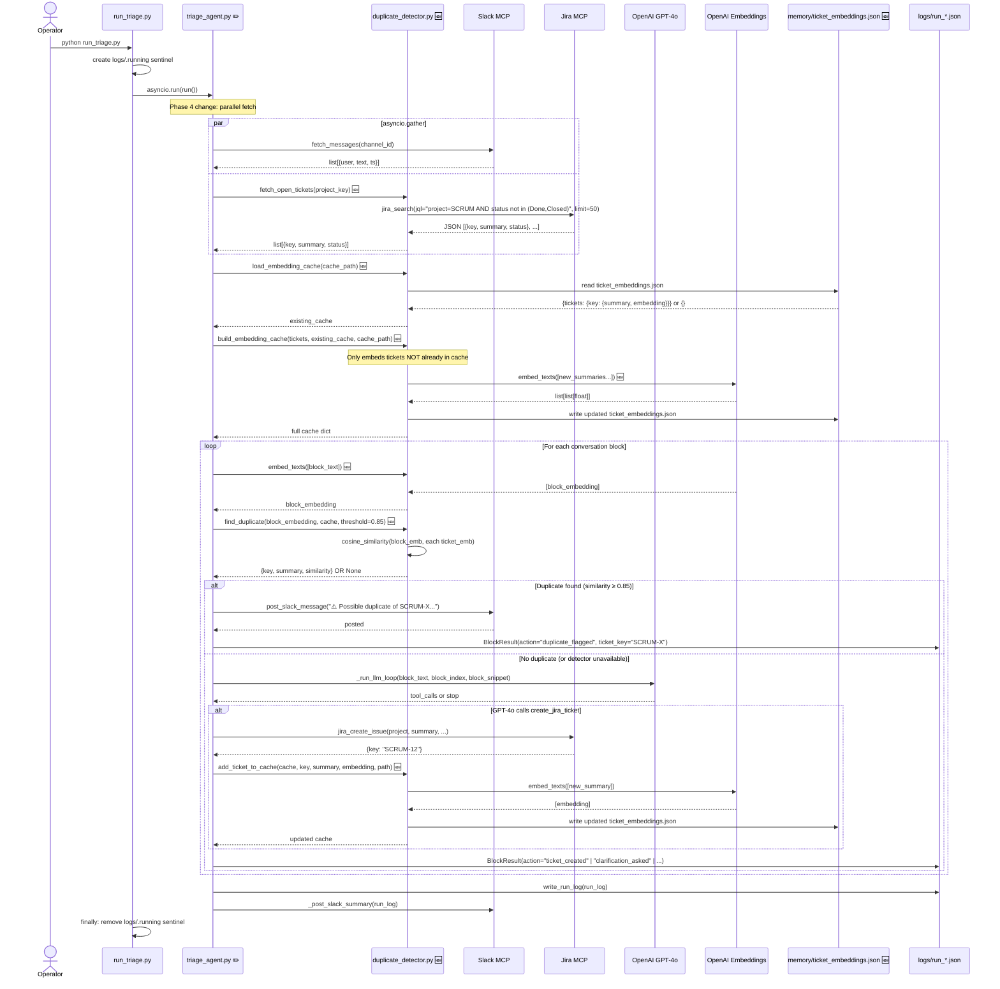
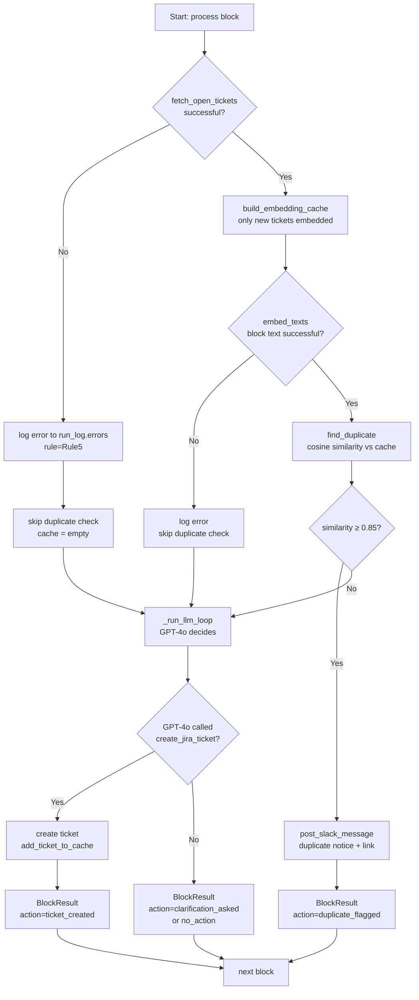

# Code Diagram: Phase 4 — Duplicate Detection

> Generated from: [Technical Design](../plans/2026-04-29-phase4-duplicate-detection-design.md)
> Last updated: 2026-04-29
> Status: approved

---

## ASCII Overview

```
  python run_triage.py
         │
         ▼
┌─────────────────────┐
│   run_triage.py     │  creates logs/.running sentinel
│   asyncio.run(run)  │
└──────────┬──────────┘
           │ run()
           ▼
┌──────────────────────────────────────────────────────────────┐
│  triage_agent.py  [MOD]                                      │
│                                                              │
│  asyncio.gather(                                             │
│    fetch_messages(),          ──▶  Slack MCP                 │
│    fetch_open_tickets()  [NEW]──▶  Jira MCP (jira_search)    │
│  )                                                           │
│                                                              │
│  build_embedding_cache() [NEW]──▶  OpenAI Embeddings API     │
│  (only embeds tickets not already cached)                    │
│                                                              │
│  FOR EACH BLOCK:                                             │
│    embed_texts([block_text]) [NEW]──▶ OpenAI Embeddings API  │
│    find_duplicate() [NEW]                                    │
│      ├─ match ≥ 0.85 → post_slack_message (duplicate notice) │
│      │                  BlockResult(duplicate_flagged)       │
│      └─ no match   → _run_llm_loop() → GPT-4o               │
│                        if ticket created:                    │
│                          add_ticket_to_cache() [NEW]         │
│                                                              │
│  write_run_log() + _post_slack_summary()                     │
└──────────────────────────────────────────────────────────────┘
           │
           ▼
┌──────────────────────────────────┐
│  pipeline/duplicate_detector.py  │  [NEW]
│  fetch_open_tickets()            │──▶  jira_mcp_session() → Jira MCP
│  embed_texts()                   │──▶  OpenAI Embeddings API
│  load_embedding_cache()          │──▶  memory/ticket_embeddings.json (read)
│  build_embedding_cache()         │──▶  memory/ticket_embeddings.json (write)
│  find_duplicate() / cosine_sim() │    (pure, no I/O)
│  add_ticket_to_cache()           │──▶  memory/ticket_embeddings.json (write)
└──────────────────────────────────┘
```

---

## Sequence Diagram



---

## Flowchart — Duplicate Gate Decision



---

## Data Flow Summary

| Data | Source | Shape | Destination |
|------|--------|-------|-------------|
| Open Jira tickets | Jira MCP `jira_search` | `[{key, summary, status}]` | `build_embedding_cache()` |
| Ticket embeddings (cached) | `memory/ticket_embeddings.json` | `{key: {summary, status, embedding: float[]}}` | `find_duplicate()` |
| Ticket embeddings (new) | OpenAI `text-embedding-3-small` | `list[list[float]]` | Written to cache file |
| Block embedding | OpenAI `text-embedding-3-small` | `list[float]` | `find_duplicate()` |
| Duplicate match | `find_duplicate()` | `{key, summary, similarity}` or `None` | `post_slack_message()` + `BlockResult` |
| New ticket embedding | OpenAI after ticket creation | `list[float]` | `add_ticket_to_cache()` → cache file |
| Run log | `triage_agent.run()` | `RunLog` with `duplicates_flagged_count` | `logs/run_<id>.json` |

**Stored/mutated:**
- `memory/ticket_embeddings.json` — built at run start, updated after each new ticket creation
- `logs/run_<id>.json` — includes `duplicates_flagged_count` + per-block `action="duplicate_flagged"`

---

## Flow Plain-English

- **Parallel Fetch** (`triage_agent.run()` via `asyncio.gather`)
  - **Purpose:** Fetch Slack messages and open Jira tickets at the same time so neither waits on the other
  - **Input:** `channel_id` (Slack), `project_key` (Jira)
  - **Output:** `list[slack_message]`, `list[{key, summary, status}]`

- **Cache Bootstrap** (`duplicate_detector.build_embedding_cache()`)
  - **Purpose:** Build or update the embedding cache — only re-embed tickets that aren't already cached
  - **Input:** Fresh ticket list from Jira, existing cache dict from disk
  - **Output:** Full cache dict written to `memory/ticket_embeddings.json`

- **Duplicate Gate** (`triage_agent.run()` block loop)
  - **Purpose:** Before calling GPT-4o, check if this Slack message is already tracked in Jira
  - **Input:** Block text (raw Slack messages), cache dict, similarity threshold (0.85)
  - **Output:** `{key, summary, similarity}` if duplicate found, else `None`

- **Duplicate Notice** (`triage_agent.run()` → `post_slack_message()`)
  - **Purpose:** Tell the team "this looks like an existing ticket — is it the same issue?"
  - **Input:** Matching ticket key + summary + similarity score
  - **Output:** Slack message posted; `BlockResult(action="duplicate_flagged")`

- **Cache Update** (`duplicate_detector.add_ticket_to_cache()`)
  - **Purpose:** After a new ticket is created, add it to the cache immediately so a second identical block in the same run is also caught
  - **Input:** New ticket key, summary, pre-computed embedding
  - **Output:** Updated `memory/ticket_embeddings.json`

- **Cosine Similarity** (`duplicate_detector.cosine_similarity()`)
  - **Purpose:** Measure how semantically close two pieces of text are (1.0 = identical, 0.0 = unrelated)
  - **Input:** Two float vectors (embeddings) of equal length
  - **Output:** Float in [0.0, 1.0]

- **Fallback: Skip Duplicate Check** (`duplicate_detector` error path)
  - **Purpose:** If Jira search or embeddings fail, don't block the run — log the error and continue
  - **Input:** Exception from Jira MCP or OpenAI Embeddings
  - **Output:** `cache = {}`, error appended to `run_log.errors`, LLM loop proceeds normally
