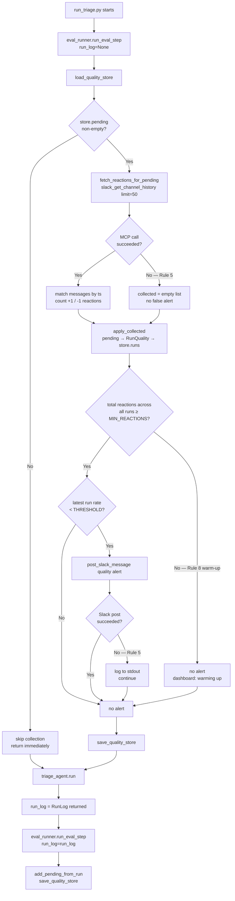

# Code Diagram: Phase 5 — Eval & Feedback Loop

> Generated from: [Technical Design](../plans/2026-04-29-phase5-eval-feedback-design.md)
> Last updated: 2026-04-29
> Status: draft

---

## ASCII Overview

```
  ┌───────────────────────────────────────────────────────────┐
  │  run_triage.py  [MOD]  (entry point / lifecycle shell)    │
  │                                                           │
  │  1. await eval_runner.run_eval_step()   ← Step 0: pre    │
  │  2. run_log = await triage_agent.run()  ← triage         │
  │  3. await eval_runner.run_eval_step(run_log) ← Step 7    │
  └──────┬────────────────────────┬─────────────────┬────────┘
         │ Step 0 / Step 7        │ triage           │
         ▼                        ▼                  │
  ┌──────────────────┐  ┌──────────────────────┐     │
  │ eval_runner.py   │  │ triage_agent.py [MOD]│     │
  │ [NEW]            │  │                      │     │
  │ run_eval_step()  │  │ run() → RunLog       │     │
  └──────┬───────────┘  │ (returns log now)    │     │
         │              └──────────┬───────────┘     │
         │                         │                  │
    ┌────▼─────────┐    ┌──────────▼──────────┐       │
    │ reaction_    │    │ slack_tools.py [MOD] │       │
    │ collector.py │    │                      │       │
    │ [NEW]        │    │ post_slack_message() │       │
    │ fetch_react  │    │ → captures ts        │       │
    │ ions_for_    │    │   into buffer        │       │
    │ pending()    │    │ drain_confirmation   │       │
    └──────┬───────┘    │ _ts()  [NEW]         │       │
           │            └──────────────────────┘       │
           │                                           │
    ┌──────▼────────────────────────────────────┐      │
    │  Slack MCP  (npx @modelcontextprotocol/   │◀─────┘
    │  server-slack)                            │
    │  slack_get_channel_history  (reactions)   │
    │  slack_post_message  (confirmations/alert)│
    └───────────────────────────────────────────┘

    ┌──────────────────────────────────┐
    │ quality_metrics.py [NEW]         │
    │ load/save_quality_store()        │
    │ add_pending_from_run()           │
    │ apply_collected()                │
    │ should_alert()                   │
    └──────────────┬───────────────────┘
                   │
    ┌──────────────▼───────────────────┐
    │ memory/quality_store.json [NEW]  │
    │ {pending: [...], runs: [...]}    │
    └──────────────────────────────────┘

    ┌──────────────────────────────────┐
    │ pipeline/run_logger.py [MOD]     │
    │ BlockResult.confirmation_ts [NEW]│
    └──────────────────────────────────┘
```

---

## Sequence Diagram

```mermaid
sequenceDiagram
    autonumber
    participant CLI   as Terminal<br/>python run_triage.py
    participant RTR   as run_triage.py ✏️<br/>main()
    participant EVR   as eval_runner.py 🆕<br/>run_eval_step()
    participant QM    as quality_metrics.py 🆕
    participant QS    as memory/<br/>quality_store.json 🆕
    participant RC    as reaction_collector.py 🆕
    participant SM    as Slack MCP<br/>(npx server-slack)
    participant TA    as triage_agent.py ✏️<br/>run()
    participant ST    as slack_tools.py ✏️<br/>post_slack_message()
    participant LLM   as triage_agent.py<br/>_run_llm_loop()
    participant RL    as run_logger.py ✏️<br/>BlockResult

    CLI->>RTR: asyncio.run(main())

    Note over RTR,QS: ── Step 0: Pre-triage eval (eval_runner, run_log=None) ──

    RTR->>EVR: await run_eval_step(run_log=None)
    EVR->>QM: load_quality_store(QUALITY_STORE_PATH)
    QM->>QS: read memory/quality_store.json
    QS-->>QM: {pending:[...], runs:[...]} or {}
    QM-->>EVR: QualityStore

    alt store.pending is non-empty
        EVR->>RC: fetch_reactions_for_pending(<br/>pending, channel_id,<br/>REACTION_HISTORY_LIMIT,<br/>REACTION_WINDOW_HOURS)
        RC->>SM: slack_mcp_session()<br/>call_tool("slack_get_channel_history",<br/>{channel_id, limit: 50})
        SM-->>RC: {messages: [{ts, text,<br/>reactions:[{name,count}]},...]}
        RC-->>EVR: list[CollectedReaction] ([] on any error — Rule 5)

        EVR->>QM: apply_collected(store, collected)
        Note over QM: pending → RunQuality → store.runs<br/>removes processed pending entries

        EVR->>QM: should_alert(store, QUALITY_ALERT_THRESHOLD,<br/>MIN_REACTIONS_FOR_QUALITY)
        QM-->>EVR: (True, RunQuality) or (False, None)

        alt alert == True
            EVR->>ST: post_slack_message("⚠️ Quality alert…")
            ST->>SM: call_tool("slack_post_message",<br/>{channel_id, text: "⚠️ Quality alert…"})
            SM-->>ST: {ts: "...", ok: true}
            ST-->>EVR: "Message posted: ⚠️ Quality alert…"
        end

        EVR->>QM: save_quality_store(store, QUALITY_STORE_PATH)
        QM->>QS: write memory/quality_store.json
    end

    EVR-->>RTR: (returns)

    Note over RTR,RL: ── Triage: triage_agent.run() — unchanged contract + return RunLog ──

    RTR->>TA: run_log = await triage_agent.run()

    Note over TA,SM: Steps 1-3 existing: fetch messages, build cache, group blocks

    loop For each conversation block
        TA->>ST: drain_confirmation_ts()
        Note over ST: clears _confirmation_ts_buffer
        ST-->>TA: None (buffer empty)

        TA->>LLM: _run_llm_loop(block_text,<br/>block_index, block_snippet)

        Note over LLM,SM: Duplicate gate → existing (may call post_slack_message;<br/>ts captured but discarded at start of next block's drain)

        LLM->>ST: post_slack_message("✅ Created SCRUM-X…")
        ST->>SM: call_tool("slack_post_message",<br/>{channel_id, text: "✅ Created SCRUM-X…"})
        SM-->>ST: result.content[0].text<br/>= '{"ok":true,"ts":"1714406400.123","…"}'
        Note over ST: parse ts → _confirmation_ts_buffer.append(ts)<br/>(silent no-op on parse failure)
        ST-->>LLM: "Message posted: ✅ Created SCRUM-X…"

        LLM-->>TA: BlockResult(action="ticket_created",<br/>ticket_key="SCRUM-X", …)

        alt result.action == "ticket_created"
            TA->>ST: drain_confirmation_ts()
            ST-->>TA: "1714406400.123" (or None)
            TA->>RL: result.confirmation_ts = ts
        end
    end

    Note over TA: Steps 5-6 existing: error report + write_run_log + Slack summary
    TA-->>RTR: run_log (RunLog)  ← was None before Phase 5

    Note over RTR,QS: ── Step 7: Post-triage eval (eval_runner, run_log given) ──

    RTR->>EVR: await run_eval_step(run_log=run_log)
    EVR->>QM: add_pending_from_run(store, run_log)
    Note over QM: scans BlockResults for confirmation_ts ≠ None<br/>appends as PendingReaction to store.pending

    EVR->>QM: save_quality_store(store, QUALITY_STORE_PATH)
    QM->>QS: write memory/quality_store.json
    EVR-->>RTR: (returns)
```

---

## Flowchart — Reaction Collection & Alert Decision



---

## Flowchart — ts Capture Inside `post_slack_message` (Spike-Gated)

```mermaid
flowchart TD
    A["post_slack_message(message)"] --> B[slack_mcp_session<br/>call_tool slack_post_message]
    B --> C{result has<br/>content[0].text?}
    C -->|No| SKIP[buffer unchanged — silent]
    C -->|Yes| D[json.loads result.content[0].text]
    D --> E{parse succeeded?}
    E -->|No — silent| SKIP
    E -->|Yes| F{ts key present?}
    F -->|No — spike failed| G[Option B fallback:<br/>post-hoc channel history fetch]
    F -->|Yes| H[_confirmation_ts_buffer.append ts]
    G --> I[return "Message posted: message"]
    H --> I
    SKIP --> I
```

---

## Data Flow Summary

| Data | Source | Shape | Destination |
|---|---|---|---|
| Channel history (reactions) | Slack MCP `slack_get_channel_history` | `{messages: [{ts, text, reactions:[{name,count}]}]}` | `reaction_collector.py` → `list[CollectedReaction]` |
| `confirmation_ts` | `slack_post_message` MCP response (parsed) | `str` e.g. `"1714406400.123456"` | `_confirmation_ts_buffer` → `BlockResult.confirmation_ts` |
| `RunLog` | `triage_agent.run()` return value | `RunLog` dataclass | `run_triage.py` → `eval_runner.run_eval_step(run_log)` |
| `PendingReaction` entries | `eval_runner` post-triage step | `{run_id, block_index, ticket_key, confirmation_ts, posted_at_iso}` | `memory/quality_store.json` |
| `RunQuality` entries | `apply_collected()` | `{run_id, thumbs_up, thumbs_down, reactions_found, thumbs_up_rate}` | `memory/quality_store.json` → dashboard |
| Quality alert | `should_alert()` returns `(True, RunQuality)` | plain text Slack message | Slack MCP `slack_post_message` |

**What is stored / mutated:**

- `memory/quality_store.json` — written twice per run: Step 0 (after collection), Step 7 (after adding pending)
- `BlockResult.confirmation_ts` — set inside `triage_agent.run()` per block; persisted via `write_run_log`
- `_confirmation_ts_buffer` — module-level list in `slack_tools.py`; drained at start of each block then again after ticket_created

---

## Flow Plain-English

- **Pre-triage eval** (`run_triage.py → eval_runner.run_eval_step(run_log=None)`)
  - **Purpose:** Before triage runs, collect any reactions that have appeared on prior confirmation posts and fire a quality alert if the thumbs-up rate is below threshold
  - **Input:** Nothing (reads `quality_store.json` internally)
  - **Output:** Updated `quality_store.json`; optional Slack quality alert posted

- **Reaction collection** (`eval_runner → reaction_collector.fetch_reactions_for_pending()`)
  - **Purpose:** One Slack history call to find 👍/👎 reactions on known confirmation message timestamps
  - **Input:** List of `PendingReaction` items (confirmation posts not yet polled), channel ID, history limit, window hours
  - **Output:** `list[CollectedReaction]` with thumbs_up/thumbs_down counts; `[]` on any MCP error (Rule 5)

- **Quality gate** (`eval_runner → quality_metrics.should_alert()`)
  - **Purpose:** Decide whether to fire a quality alert, enforcing the warm-up gate (Rule 8)
  - **Input:** `QualityStore`, `QUALITY_ALERT_THRESHOLD`, `MIN_REACTIONS_FOR_QUALITY`
  - **Output:** `(True, RunQuality)` if rate below threshold and minimum reactions met; `(False, None)` otherwise

- **Triage run** (`run_triage.py → triage_agent.run()`)
  - **Purpose:** Classify Slack messages, create Jira tickets, post confirmations — unchanged from Phases 1-4 except it now returns `RunLog`
  - **Input:** Nothing (reads settings internally)
  - **Output:** `RunLog` dataclass (was `None` before Phase 5)

- **ts capture** (`slack_tools.post_slack_message()` → `_confirmation_ts_buffer`)
  - **Purpose:** Capture the Slack message timestamp of every confirmation post so reactions can be polled next run
  - **Input:** MCP response from `slack_post_message`
  - **Output:** Appends `ts: str` to module-level buffer; silent no-op on parse failure (Rule 9)

- **ts drain** (`triage_agent.run()` → `slack_tools.drain_confirmation_ts()`)
  - **Purpose:** Retrieve and clear the captured ts after the LLM loop and attach it to the `BlockResult`
  - **Input:** Module-level buffer (cleared as side effect)
  - **Output:** Last captured `ts: str` or `None`

- **Post-triage eval** (`run_triage.py → eval_runner.run_eval_step(run_log)`)
  - **Purpose:** Register all new confirmation posts from this run so they can be polled for reactions next run
  - **Input:** `RunLog` returned by `triage_agent.run()`
  - **Output:** `PendingReaction` entries appended to `quality_store.json`

- **Quality store persistence** (`quality_metrics.save_quality_store()`)
  - **Purpose:** Persist quality state to disk so it survives between runs
  - **Input:** `QualityStore`, path
  - **Output:** Writes `memory/quality_store.json`; logs warning on failure, never raises (Rule 5)

- **Dashboard quality trend** (`dashboard.py` reads `memory/quality_store.json`)
  - **Purpose:** Show the operator a time-series of thumbs-up rate per run
  - **Input:** `quality_store.json → runs: [RunQuality, …]`
  - **Output:** Streamlit chart (x = run_id timestamp, y = thumbs_up_rate %); "Warming up (N/MIN)" label if below minimum
