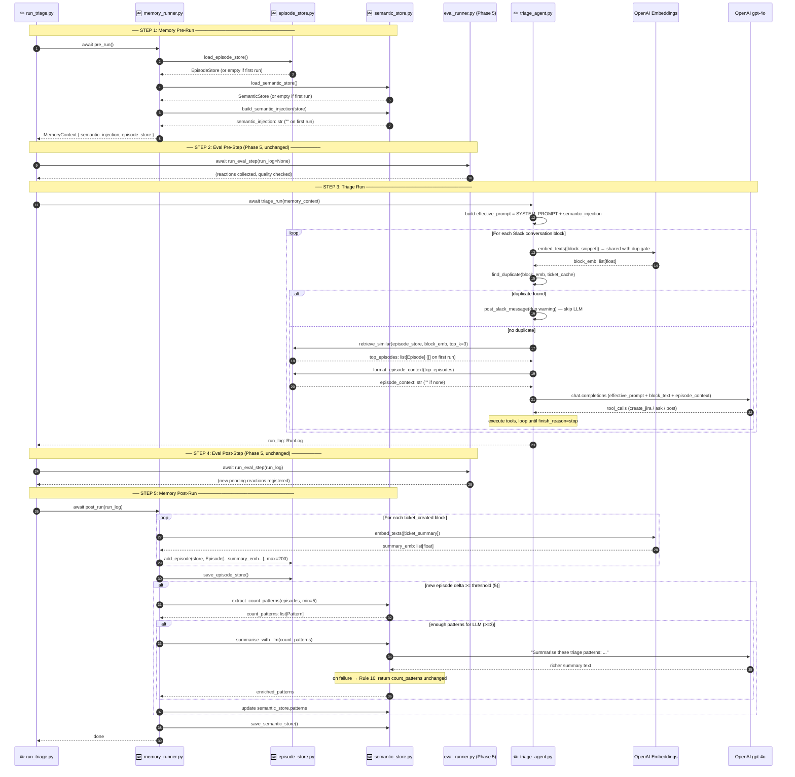
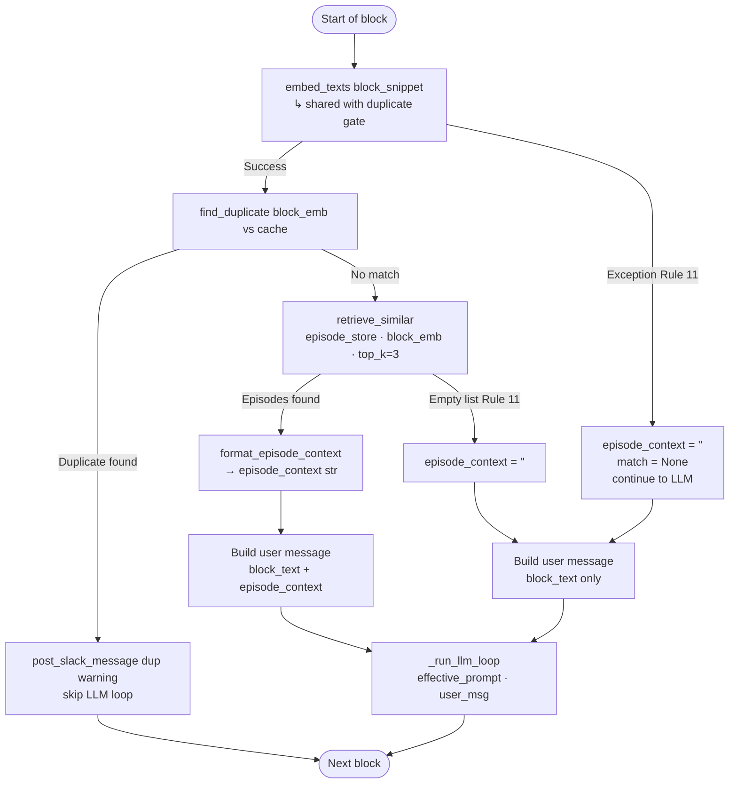
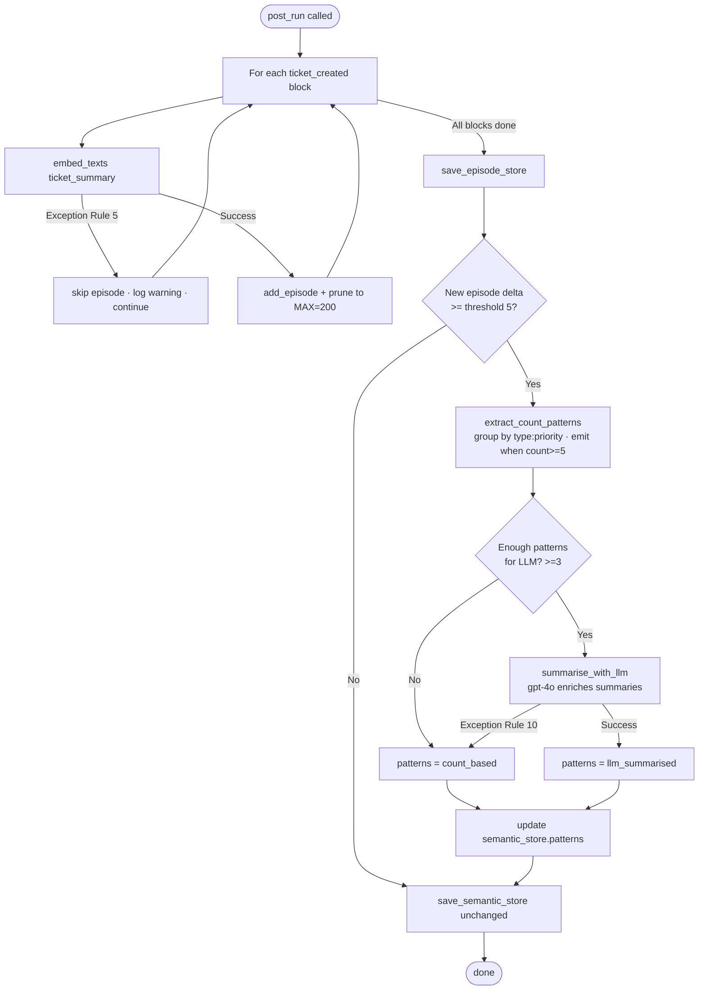

# Code Diagram: Phase 7 — Agent Memory (Episodic + Semantic + Working)

> Generated from: [Technical Design](../plans/2026-04-29-phase7-memory-design.md)
> Last updated: 2026-04-29
> Status: approved

---

## ASCII Overview — End-to-End Run Timeline

The run has **5 ordered steps**. Memory wraps the outside; eval wraps the middle; triage is the core.

```
 python run_triage.py
          │
          ▼
 ┌────────────────────────────────────────────────────────────────────┐
 │  run_triage.py  main()  [MOD]                                      │
 │                                                                    │
 │  STEP 1  memory_ctx = await memory_runner.pre_run()    ← NEW      │
 │  STEP 2  await run_eval_step(run_log=None)             ← Phase 5  │
 │  STEP 3  run_log  = await triage_run(memory_ctx)       ← MOD      │
 │  STEP 4  await run_eval_step(run_log)                  ← Phase 5  │
 │  STEP 5  await memory_runner.post_run(run_log)         ← NEW      │
 └────────────────────────────────────────────────────────────────────┘
```

---

### STEP 1 — Memory Pre-Run  (`memory_runner.pre_run`)

What happens before triage starts:

```
  memory_runner.pre_run()
  │
  ├─▶ episode_store.py: load_episode_store("memory/episode_store.json")
  │       safe on missing file → returns empty EpisodeStore
  │       output: EpisodeStore { episodes: [Episode, ...] }
  │
  ├─▶ semantic_store.py: load_semantic_store("memory/semantic_store.json")
  │       safe on missing file → returns empty SemanticStore
  │       output: SemanticStore { patterns: [Pattern, ...] }
  │
  ├─▶ semantic_store.py: build_semantic_injection(store, max_chars=1000)
  │       formats active patterns as text for the system prompt
  │       output: str  e.g. "## Learned Patterns\n- Bug:High (8)..."
  │               "" if no patterns yet
  │
  └─▶ returns  MemoryContext {
            semantic_injection: str      ← injected into SYSTEM_PROMPT
            episode_store: EpisodeStore  ← used for per-block retrieval in Step 3
        }
```

---

### STEP 3 — Triage Run  (`triage_agent.run(memory_context)`)

What happens inside each conversation block:

```
  triage_agent.run(memory_context)
  │
  ├── BUILD EFFECTIVE SYSTEM PROMPT  (once, before block loop)
  │     effective_prompt = SYSTEM_PROMPT
  │     if memory_context.semantic_injection:
  │         effective_prompt += "\n\n## Learned Patterns\n" + semantic_injection
  │
  └── FOR EACH BLOCK:
        │
        ├─1─ embed_texts([block_snippet])   ← ONE embed call, shared with duplicate gate
        │         ↓ OpenAI text-embedding-3-small
        │         block_emb: list[float]
        │
        ├─2─ find_duplicate(block_emb, ticket_cache)  ← Phase 4, unchanged
        │         if match → post duplicate message, skip to next block
        │
        ├─3─ episode_store.retrieve_similar(episode_store, block_emb, top_k=3)
        │         cosine_similarity(block_emb, ep.embedding) for each stored episode
        │         returns top-3 most similar Episodes  ([] if store empty → Rule 11)
        │
        ├─4─ episode_store.format_episode_context(top_episodes)
        │         returns episode_context: str
        │         e.g. "## Similar past decisions\n- [SCRUM-8] 'Login...' → Bug, High"
        │         returns "" if no matches
        │
        └─5─ _run_llm_loop(block_text, episode_context=episode_context)
                  sends to GPT-4o:
                  ┌──────────────────────────────────────────────────────────────┐
                  │  SYSTEM:  effective_prompt    (rules + learned patterns)     │
                  │  USER:    "Slack message(s):\n\n{block_text}"                │
                  │           + "\n\n## Similar past decisions\n{episode_ctx}"   │
                  └──────────────────────────────────────────────────────────────┘
                  GPT-4o decides: create_jira_ticket / ask_for_clarification / post_slack_message
```

---

### STEP 5 — Memory Post-Run  (`memory_runner.post_run`)

What happens after triage completes:

```
  memory_runner.post_run(run_log)
  │
  ├── FOR EACH ticket_created block in run_log.blocks:
  │     │
  │     ├─▶ embed_texts([block.ticket_summary])   ← OpenAI (1 call per new ticket)
  │     │       on failure: skip episode, log warning (Rule 5), continue
  │     │
  │     └─▶ episode_store.add_episode(store, Episode {
  │               run_id, block_index,
  │               block_snippet,       ← raw Slack text (shown in injection)
  │               ticket_key, ticket_type, ticket_priority, ticket_summary,
  │               embedding,           ← from embed_texts(ticket_summary)
  │               run_ts
  │           }, max=200)
  │           prunes oldest if len > MAX_EPISODES
  │
  ├─▶ save_episode_store()   (Rule 5: log warning on failure, never raise)
  │
  ├── IF new episodes added AND delta >= SEMANTIC_EXTRACTION_THRESHOLD (5):
  │     │
  │     ├─▶ semantic_store.extract_count_patterns(episodes, min_count=5)
  │     │       groups by (ticket_type, ticket_priority)
  │     │       emits Pattern when count >= 5
  │     │       pure function — no API call
  │     │
  │     ├── IF len(patterns) >= SEMANTIC_LLM_MIN_PATTERNS (3):
  │     │     │
  │     │     └─▶ semantic_store.summarise_with_llm(patterns)   ← OpenAI gpt-4o
  │     │             on failure: return patterns unchanged (Rule 10)
  │     │             on success: patterns.source = "llm_summarised"
  │     │
  │     └─▶ semantic_store.patterns = enriched_patterns
  │
  └─▶ save_semantic_store()   (Rule 5: log warning on failure, never raise)
```

---

## What the LLM Actually Sees

This is what changes inside the GPT-4o context window after Phase 7:

```
 ┌──────────────────────────────────────────────────────────────────────────────┐
 │  SYSTEM PROMPT (built once per run)                                          │
 │  ─────────────────────────────────                                           │
 │  You are a software triage agent monitoring a Slack channel...               │
 │  [original rules — classification, priority guide, guardrails]               │
 │                                                           ↑ always present   │
 │  ─ ─ ─ ─ ─ ─ ─ ─ ─ ─ ─ ─ ─ ─ ─ ─ ─ ─ ─ ─ ─ ─ ─ ─ ─ ─ ─                  │
 │  ## Learned Patterns                   ← NEW (Phase 7, semantic injection)   │
 │  - Bug:High (8 decisions) — Login and authentication issues have             │
 │    consistently been triaged as Bug, High priority                           │
 │  - Story:Medium (5 decisions) — Export and download feature requests         │
 │    consistently triaged as Story, Medium priority                            │
 └──────────────────────────────────────────────────────────────────────────────┘

 ┌──────────────────────────────────────────────────────────────────────────────┐
 │  USER MESSAGE (built per block)                                              │
 │  ──────────────────────────────                                              │
 │  Slack message(s):                                                           │
 │                                                                              │
 │  alice: Login fails after clicking the password reset link                   │
 │  bob: same here, just tried on Chrome and Firefox                            │
 │                                              ↑ always present (block_text)   │
 │  ─ ─ ─ ─ ─ ─ ─ ─ ─ ─ ─ ─ ─ ─ ─ ─ ─ ─ ─ ─ ─ ─ ─ ─ ─ ─ ─ ─ ─ ─ ─ ─ ─ ─   │
 │  ## Similar past decisions    ← NEW (Phase 7, episodic injection)            │
 │  - [SCRUM-8]  "Login page crashes on empty email field" → Bug, High         │
 │  - [SCRUM-19] "Authentication fails after password reset" → Bug, High       │
 │  - [SCRUM-31] "Session timeout error on login" → Bug, Medium                │
 └──────────────────────────────────────────────────────────────────────────────┘
```

**Result:** GPT-4o sees both *stable run-wide patterns* (system prompt) and *specific similar past cases* (user message). It no longer re-derives the answer from scratch.

---

## Sequence Diagram — Full Run



---

## Flowchart — What Happens Per Block



---

## Flowchart — What Happens After the Run (`post_run`)



---

## Data Flow Summary

| When | What | Direction | Store |
|---|---|---|---|
| `pre_run` start | Load past episodes | disk → memory | `memory/episode_store.json` |
| `pre_run` start | Load learned patterns | disk → memory | `memory/semantic_store.json` |
| `triage run()` start | Inject semantic patterns | memory → SYSTEM_PROMPT | (runtime only) |
| Per block | Inject similar episodes | memory → user message | (runtime only) |
| `post_run` end | Write new episodes | memory → disk | `memory/episode_store.json` |
| `post_run` end | Write updated patterns | memory → disk | `memory/semantic_store.json` |

---

## Rule Reference

```
Rule 5  — Any I/O or embed failure in post_run   → log warning, skip, never raise
Rule 10 — LLM summarisation fails                → keep count-based patterns, continue
Rule 11 — embed_texts fails per block            → episode_context="", match=None, continue
           retrieve_similar returns []            → episode_context="", continue
```
