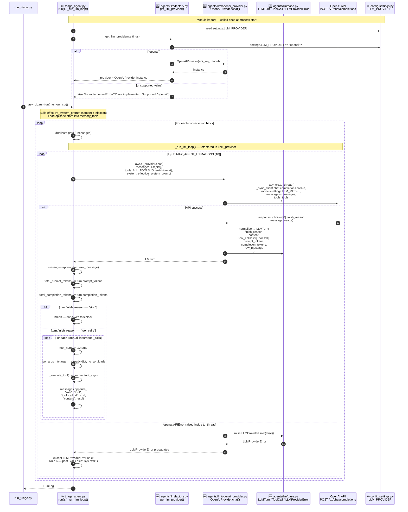
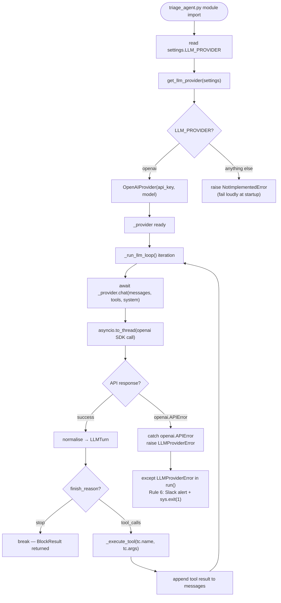

# Code Diagram: Phase 8 — Model-Agnostic LLM Provider

> Generated from: [Technical Design](../plans/2026-04-30-phase8-llm-provider-design.md)
> Last updated: 2026-04-30
> Status: draft

---

## ASCII Overview

```
  ENTRY POINT                   AGENT CORE                    LLM ABSTRACTION LAYER [NEW]
  ─────────────────             ────────────────────────────  ────────────────────────────────
  ┌─────────────────┐           ┌──────────────────────────┐  ┌──────────────────────────────┐
  │  run_triage.py  │─run()────▶│  triage_agent.py  [MOD]  │  │  agents/llm/                 │
  │                 │           │                          │  │                              │
  │  asyncio.run()  │           │  _provider [NEW]         │──│  factory.py   [NEW]          │
  └─────────────────┘           │  = get_llm_provider()    │  │  get_llm_provider(settings)  │
                                │                          │  │         │                    │
                                │  _run_llm_loop()  [MOD]  │  │         ▼                    │
                                │    _provider.chat()      │  │  openai_provider.py  [NEW]   │
                                │         │                │  │  OpenAIProvider.chat()       │
                                │         │ LLMTurn        │  │         │                    │
                                │         ▼                │  │  base.py  [NEW]              │
                                │  turn.finish_reason      │  │  LLMProvider (Protocol)      │
                                │  turn.tool_calls (list)  │  │  LLMTurn  (dataclass)        │
                                │  turn.raw_message        │  │  ToolCall (dataclass)        │
                                │  turn.prompt_tokens      │  │  LLMProviderError            │
                                └──────────────────────────┘  └──────────────────────────────┘
                                           │                              │
                                           │                asyncio.to_thread()
                                           │                              │
                                           ▼                              ▼
                                  ┌──────────────────────────────────────────┐
                                  │         OpenAI API  (HTTPS)              │
                                  │  POST /v1/chat/completions               │
                                  │  model=gpt-4o, messages, tools           │
                                  │  Auth: Bearer OPENAI_API_KEY             │
                                  └──────────────────────────────────────────┘

  CONFIG                        NOT CHANGED
  ────────────────              ──────────────────────────────────────────────
  ┌─────────────────┐           jira_tools.py    ← OpenAI-format schemas unchanged
  │  settings.py    │           slack_tools.py   ← OpenAI-format schemas unchanged
  │  [MOD]          │           memory_tools.py  ← OpenAI-format schemas unchanged
  │  + LLM_PROVIDER │           semantic_store.py← direct openai.OpenAI() unchanged
  │    "openai"     │           duplicate_detector.py ← embeddings always OpenAI
  └─────────────────┘
```

---

## Sequence Diagram



---

## Flowchart — Provider Resolution and Error Handling



---

## Data Flow Summary

| Stage | Source | Shape | Destination |
|-------|--------|-------|-------------|
| Settings read | `config/.env` | `LLM_PROVIDER: str` (new) | `settings.py` → `factory.py` |
| Provider creation | `factory.py` | `OpenAIProvider` instance | `triage_agent._provider` |
| LLM call input | `_run_llm_loop()` | `messages: list[dict]`, `tools: list[dict]` (OpenAI format), `system: str` | `OpenAIProvider.chat()` |
| OpenAI raw response | `openai SDK` | `ChatCompletion` object | `OpenAIProvider.chat()` → normalised |
| LLM call output | `OpenAIProvider.chat()` | `LLMTurn(finish_reason, content, tool_calls: list[ToolCall], prompt_tokens, completion_tokens, raw_message)` | `_run_llm_loop()` |
| Tool dispatch | `_run_llm_loop()` | `tc.name: str`, `tc.args: dict` (already parsed) | `_execute_tool()` |
| Error path | `openai.APIError` | wrapped as `LLMProviderError(str)` | `run()` → Rule 6 |

**What is stored/mutated:**
- No new files written — this is a pure refactor of the call path
- `config/.env` gains one optional key: `LLM_PROVIDER=openai`

**What is NOT changed:**
- Tool schema files (`jira_tools.py`, `slack_tools.py`, `memory_tools.py`) — still OpenAI-format dicts
- `pipeline/semantic_store.py` — keeps direct `openai.OpenAI()` call
- `pipeline/duplicate_detector.py` — embeddings always on OpenAI `text-embedding-3-small`
- All memory, eval, and logging infrastructure

---

## Flow Plain-English

- **Provider resolution** (`agents/llm/factory.py → get_llm_provider()`)
  - **Purpose:** Reads `LLM_PROVIDER` from settings and returns a concrete provider object; fails loudly with `NotImplementedError` if the value is unrecognised.
  - **Input:** `settings` object with `LLM_PROVIDER` string and `OPENAI_API_KEY`
  - **Output:** `OpenAIProvider` instance (or `NotImplementedError` at startup)

- **LLM turn** (`agents/llm/openai_provider.py → OpenAIProvider.chat()`)
  - **Purpose:** Wraps the synchronous OpenAI SDK call in `asyncio.to_thread()`, normalises the raw provider response into a neutral `LLMTurn` dataclass, and converts any `openai.APIError` into `LLMProviderError`.
  - **Input:** `messages: list[dict]`, `tools: list[dict]` (OpenAI-format), `system: str`
  - **Output:** `LLMTurn(finish_reason, content, tool_calls, prompt_tokens, completion_tokens, raw_message)` — or raises `LLMProviderError`

- **Response normalisation** (`agents/llm/base.py → LLMTurn / ToolCall`)
  - **Purpose:** Provides neutral dataclasses that `_run_llm_loop()` can read without knowing which provider produced them. `ToolCall.args` is always a `dict` — never a JSON string.
  - **Input:** `openai.types.chat.ChatCompletionMessage` (OpenAI SDK object)
  - **Output:** `LLMTurn` with `tool_calls: list[ToolCall]` where `args` is already parsed

- **LLM loop (refactored)** (`agents/triage/triage_agent.py → _run_llm_loop()`)
  - **Purpose:** Drives the tool-calling conversation for one Slack block. Delegates the actual API call to `_provider.chat()` instead of directly using `_client`. Reads `turn.tool_calls` (already dicts) instead of calling `json.loads()`.
  - **Input:** `block_text: str`, `block_index: int`, `block_snippet: str`, `effective_system_prompt: str`
  - **Output:** `BlockResult` — same as today, behaviour unchanged

- **Error escalation** (`agents/llm/openai_provider.py → LLMProviderError`)
  - **Purpose:** Re-raises any `openai.APIError` as `LLMProviderError` so `triage_agent.run()` can catch a single provider-neutral error type and apply Rule 6 (Slack alert + exit).
  - **Input:** `openai.APIError` (any subclass)
  - **Output:** `LLMProviderError(str(original_error))` propagated up to `run()`
