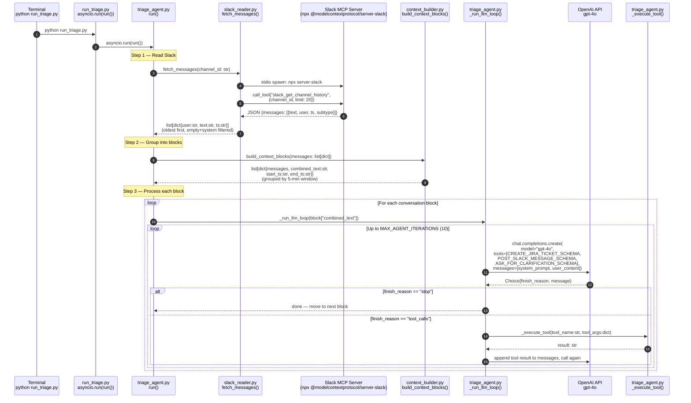
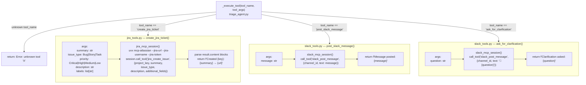
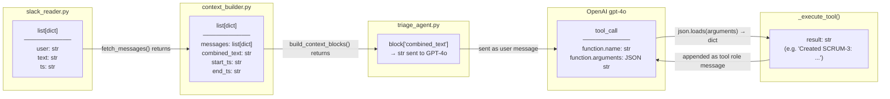

# JiraSlack — Code-Level System Diagram

> Last updated: 2026-04-30
> Phase: 8 (Model-Agnostic LLM Provider) — diagram complete, awaiting /plan

---

## Feature Diagrams

| Phase | Feature | Diagram | Design Doc |
|---|---|---|---|
| 1 | Core Pipeline | [2026-04-25-core-pipeline.md](2026-04-25-core-pipeline.md) | [design doc](../plans/2026-04-25-core-pipeline-design.md) |
| 2 | Failure Transparency | [2026-04-29-phase2-failure-transparency.md](2026-04-29-phase2-failure-transparency.md) | [design doc](../plans/2026-04-29-phase2-failure-transparency-design.md) |
| 3 | Observability | [2026-04-29-phase3-observability.md](2026-04-29-phase3-observability.md) | [design doc](../plans/2026-04-29-phase3-observability-design.md) |
| 4 | Duplicate Detection | [2026-04-29-phase4-duplicate-detection.md](2026-04-29-phase4-duplicate-detection.md) | [design doc](../plans/2026-04-29-phase4-duplicate-detection-design.md) |
| 5 | Eval & Feedback Loop | [2026-04-29-phase5-eval-feedback.md](2026-04-29-phase5-eval-feedback.md) | [design doc](../plans/2026-04-29-phase5-eval-feedback-design.md) |
| 7 | Agent Memory | [2026-04-29-phase7-memory.md](2026-04-29-phase7-memory.md) | [design doc](../plans/2026-04-29-phase7-memory-design.md) |
| 8 | Model-Agnostic LLM Provider | [2026-04-30-phase8-llm-provider.md](2026-04-30-phase8-llm-provider.md) | [design doc](../plans/2026-04-30-phase8-llm-provider-design.md) |

---

## ASCII System Overview (no rendering needed)

```
  DASHBOARD (Phase 3)          ENTRY POINT                AGENT CORE
  ──────────────────           ───────────────────────    ──────────────────────────────────
  ┌─────────────────┐          ┌───────────────────────┐  ┌──────────────────────────────┐
  │  dashboard.py   │─Popen──▶│  run_triage.py        │─▶│  triage_agent.py   run()     │
  │  streamlit run  │          │  create sentinel      │  │                              │
  │  load_run_logs()│◀─JSON───│  asyncio.run(run())   │  │  1. fetch_messages()         │
  │  polls .running │          │  finally:             │  │  2. build_context_blocks()   │
  └─────────────────┘          │    delete sentinel    │  │  3. for each block:          │
                               └───────────────────────┘  │    _run_llm_loop() [MOD]    │
  LOGS (Phase 3)                                           │    → returns BlockResult    │
  ──────────────────                                       │    _print_block_outcome()   │
  ┌─────────────────┐          ┌───────────────────────┐  │  4. write_run_log()         │
  │  logs/          │◀─write──│  run_logger.py [NEW]  │◀─│  5. _post_slack_summary()   │
  │  .running       │          │  write_run_log()      │  │  6. _print_run_summary()    │
  │  run_*.json     │          │  load_run_logs()      │  └──────────────────────────────┘
  └─────────────────┘          └───────────────────────┘

python run_triage.py
         │
         ▼
 ┌───────────────────────────────────────────────────────────────┐
 │  run_triage.py  [MOD Phase 5 + Phase 7]                       │
 │                                                               │
 │  memory_ctx = await memory_runner.pre_run()  ← NEW Phase 7   │
 │  await eval_runner.run_eval_step()           ← Step 0: pre   │
 │  run_log = await triage_agent.run(memory_ctx)← triage (MOD)  │
 │  await eval_runner.run_eval_step(run_log)    ← Step 7: post  │
 │  await memory_runner.post_run(run_log)       ← NEW Phase 7   │
 └───────────┬──────────────────────┬──────────────┬────────────┘
             │ eval hooks           │ triage       │ memory hooks
             ▼                      ▼              ▼
 ┌────────────────────┐  ┌──────────────────────────────────────────┐
 │ eval_runner.py     │  │  agents/triage/triage_agent.py   run()  │  ┌──────────────────────┐
 │ [NEW Phase 5]      │  │  [MOD Phase 5+7]                        │  │ memory_runner.py     │
 │ run_eval_step()    │  │                                          │  │ [NEW Phase 7]        │
 └──────┬─────────────┘  │  effective_prompt = SYSTEM_PROMPT        │  │ pre_run() → Context  │
        │                │            + semantic_injection   ◀──────┼──│ post_run(run_log)    │
        │                │  per block:                              │  └──────────────────────┘
        │                │    block_emb = embed_texts(snippet)      │
        │                │    find_duplicate(block_emb, ..)         │  ┌──────────────────────┐
        │                │    retrieve_similar(store, block_emb) ───┼──│ episode_store.py     │
        │                │    format_episode_context(episodes) ─────┼──│ [NEW Phase 7]        │
        │                │    _run_llm_loop(.., episode_ctx)  ────┐ │  └──────────────────────┘
        │                │                                        │ │
        ▼                └────────────────────────────────────────┼─┘  ┌──────────────────────┐
 ┌───────────────────────────┐                                    │     │ semantic_store.py    │
 │ reaction_collector.py     │ triage_agent.py   _run_llm_loop() │     │ [NEW Phase 7]        │
 │ [NEW Phase 5]             │ GPT-4o loop with injected context  │     └──────────────────────┘
 │ fetch_reactions_for_      │                                    │
 │ pending()                 │                                    ▼
 └──────┬────────────────────┘  ┌──────────────────────────────────────────────────────────┐
        │                       │  Slack MCP  (npx @modelcontextprotocol/server-slack)      │
        │                       │  slack_get_channel_history  (messages + reactions)        │
        ▼                       │  slack_post_message  (confirmations, quality alerts)      │
 ┌──────────────────────────────────────────────────────────────────────────────────────────┐
 │  OpenAI  (HTTPS)                                                                         │
 │  gpt-4o                 ← tool-calling loop (triage_agent._run_llm_loop)                │
 │  gpt-4o                 ← semantic pattern summarisation (semantic_store.summarise_*)    │
 │  text-embedding-3-small ← duplicate gate + episode retrieval (embed_texts, shared)      │
 │  text-embedding-3-small ← episode write embedding (memory_runner.post_run)              │
 └──────────────────────────────────────────────────────────────────────────────────────────┘

 ┌────────────────────────────────────┐
 │ quality_metrics.py  [NEW Phase 5] │
 │ load/save_quality_store()         │
 │ add_pending_from_run()            │
 │ apply_collected() / should_alert()│
 └────────────────┬───────────────────┘
                  ▼
 ┌────────────────────────────────────┐
 │ memory/quality_store.json [NEW]   │
 │ {pending:[...], runs:[...]}       │
 └────────────────────────────────────┘

 ─────────────────────────────────────────────────────────────────────────────
 Phase 8 — LLM Abstraction Layer (agents/llm/) [NEW]
 ─────────────────────────────────────────────────────────────────────────────

 triage_agent._run_llm_loop() previously called OpenAI SDK directly.
 After Phase 8 it calls _provider.chat() through a neutral interface:

 ┌────────────────────────────┐   ┌──────────────────────────────────────────┐
 │  triage_agent.py  [MOD]    │   │  agents/llm/  [NEW]                      │
 │  _provider =               │──▶│                                          │
 │    get_llm_provider(cfg)   │   │  factory.py   get_llm_provider(settings) │
 │                            │   │  base.py      LLMProvider (Protocol)     │
 │  _run_llm_loop():          │   │               LLMTurn (dataclass)        │
 │    turn = await            │   │               ToolCall (dataclass)       │
 │      _provider.chat(       │   │               LLMProviderError           │
 │        messages,           │   │  openai_provider.py                      │
 │        ALL_TOOLS,          │   │    OpenAIProvider.chat()                 │
 │        system_prompt)      │   │      asyncio.to_thread(SDK call)         │
 │                            │   │      normalise → LLMTurn                 │
 │    turn.finish_reason      │   │      catch openai.APIError               │
 │    turn.tool_calls[].name  │   │      → raise LLMProviderError            │
 │    turn.tool_calls[].args  │◀──│                    │                     │
 │      (already dict)        │   └────────────────────┼─────────────────────┘
 │    turn.raw_message        │                        │
 └────────────────────────────┘                        ▼
                                          OpenAI API  /v1/chat/completions
                                          (same endpoint as before Phase 8)

 NOT changed by Phase 8:
   jira_tools.py / slack_tools.py / memory_tools.py  ← schemas stay OpenAI-format
   pipeline/semantic_store.py                        ← direct openai.OpenAI() kept
   pipeline/duplicate_detector.py                    ← embeddings always OpenAI
```

**Rule reference:**
```
Rule 1 — Jira down      : catch in create_jira_ticket(), alert Slack, continue
Rule 5 — Slack MCP down : accumulate per block, consolidated post at end of run
Rule 6 — OpenAI down    : alert Slack, sys.exit(1)
Last resort             : Slack also down → write to stdout, sys.exit(1)
```

---




---

## Tool Execution Detail

When `_execute_tool()` is called, it dispatches to one of three tools:



---

## Data Structures — What Flows Between Files



---

## File Map — Where Each Responsibility Lives

```
python run_triage.py
│
├── run_triage.py  [MOD Phase 5]
│   ├── eval_runner.run_eval_step()        ← Step 0: pre-triage eval
│   ├── triage_agent.run() → RunLog        ← triage (returns log now)
│   └── eval_runner.run_eval_step(run_log) ← Step 7: post-triage eval
│
├── pipeline/eval_runner.py  [NEW Phase 5]
│   └── run_eval_step(run_log=None)        ← pre (None) or post (RunLog)
│       ├── quality_metrics.load_quality_store()
│       ├── reaction_collector.fetch_reactions_for_pending()  ← pre only
│       ├── quality_metrics.apply_collected()                 ← pre only
│       ├── quality_metrics.should_alert()                    ← pre only
│       ├── slack_tools.post_slack_message()                  ← if alert
│       ├── quality_metrics.add_pending_from_run()            ← post only
│       └── quality_metrics.save_quality_store()
│
├── pipeline/reaction_collector.py  [NEW Phase 5]
│   └── fetch_reactions_for_pending()     ← slack_get_channel_history + match by ts
│
├── pipeline/quality_metrics.py  [NEW Phase 5]
│   ├── load_quality_store() / save_quality_store()
│   ├── add_pending_from_run()
│   ├── apply_collected()
│   └── should_alert()
│
├── agents/triage/triage_agent.py  [MOD Phase 5]
│   ├── run() → RunLog                    ← was None; now returns log
│   │   └── per-block: drain_confirmation_ts() + result.confirmation_ts
│   ├── _run_llm_loop()                   ← GPT-4o tool loop (unchanged)
│   └── _execute_tool()                   ← dispatches to tool executors
│
├── pipeline/slack_reader.py
│   ├── slack_mcp_session()               ← spawns npx MCP subprocess
│   └── fetch_messages()                  ← slack_get_channel_history
│
├── pipeline/context_builder.py
│   ├── build_context_blocks()            ← groups messages by time window
│   └── _make_block()
│
├── pipeline/duplicate_detector.py  [Phase 4]
│   ├── fetch_open_tickets()              ← Jira search JQL, paginated
│   ├── build_embedding_cache()           ← diff-embed, prune, write
│   ├── find_duplicate()                  ← cosine similarity gate
│   └── add_ticket_to_cache()             ← intra-run dedup
│
├── pipeline/run_logger.py  [MOD Phase 5]
│   ├── BlockResult  (+ confirmation_ts field)
│   ├── write_run_log()
│   └── load_run_logs()
│
├── agents/triage/tools/jira_tools.py
│   ├── CREATE_JIRA_TICKET_SCHEMA
│   └── create_jira_ticket()              ← jira_mcp_session → jira_create_issue
│
├── agents/triage/tools/slack_tools.py  [MOD Phase 5]
│   ├── POST_SLACK_MESSAGE_SCHEMA
│   ├── ASK_FOR_CLARIFICATION_SCHEMA
│   ├── _confirmation_ts_buffer           ← [NEW] module-level ts capture list
│   ├── post_slack_message()              ← [MOD] parses ts from MCP response
│   ├── drain_confirmation_ts()           ← [NEW] pop + clear buffer
│   └── ask_for_clarification()
│
└── config/
    ├── settings.py   ← all config, typed, loaded from .env
    └── .env          ← secrets (never committed)
```

---

## External APIs Called

| API | Protocol | Called From | Endpoint / Tool | Auth | Failure Handling |
|-----|----------|-------------|-----------------|------|-----------------|
| Slack MCP | stdio (npx subprocess) | `slack_reader.py`, `slack_tools.py`, `reaction_collector.py` | `slack_get_channel_history`, `slack_post_message` | `SLACK_BOT_TOKEN` env var | Per-block accumulator in `run()` → consolidated Slack post at end; stdout fallback |
| OpenAI Chat | HTTPS | `triage_agent.py` | `POST /v1/chat/completions` | `OPENAI_API_KEY` | `openai.APIError` caught in `run()` → Slack alert → `sys.exit(1)` |
| Jira MCP (create) | stdio (uvx subprocess) | `jira_tools.py` | `jira_create_issue` | `--jira-username` + `--jira-token` CLI args | `Exception` caught in `create_jira_ticket()` → Slack alert → `[JIRA_ERROR]` returned to LLM |
| Jira MCP (search) | stdio (uvx subprocess) | `duplicate_detector.py` *(Phase 4)* | `jira_search` (JQL, paginated) | same `jira_mcp_session()` | Error → `cache = {}`, skip duplicate check, continue |
| OpenAI Embeddings | HTTPS | `duplicate_detector.py` *(Phase 4)* | `POST /v1/embeddings` (`text-embedding-3-small`) | `OPENAI_API_KEY` | Error → skip duplicate check, continue |
| Slack MCP (reactions) | stdio (npx subprocess) | `reaction_collector.py` *(Phase 5)* | `slack_get_channel_history` (limit=50, reads reactions field) | `SLACK_BOT_TOKEN` env var | Error → `[]` returned, no false alert, Rule 5 |
